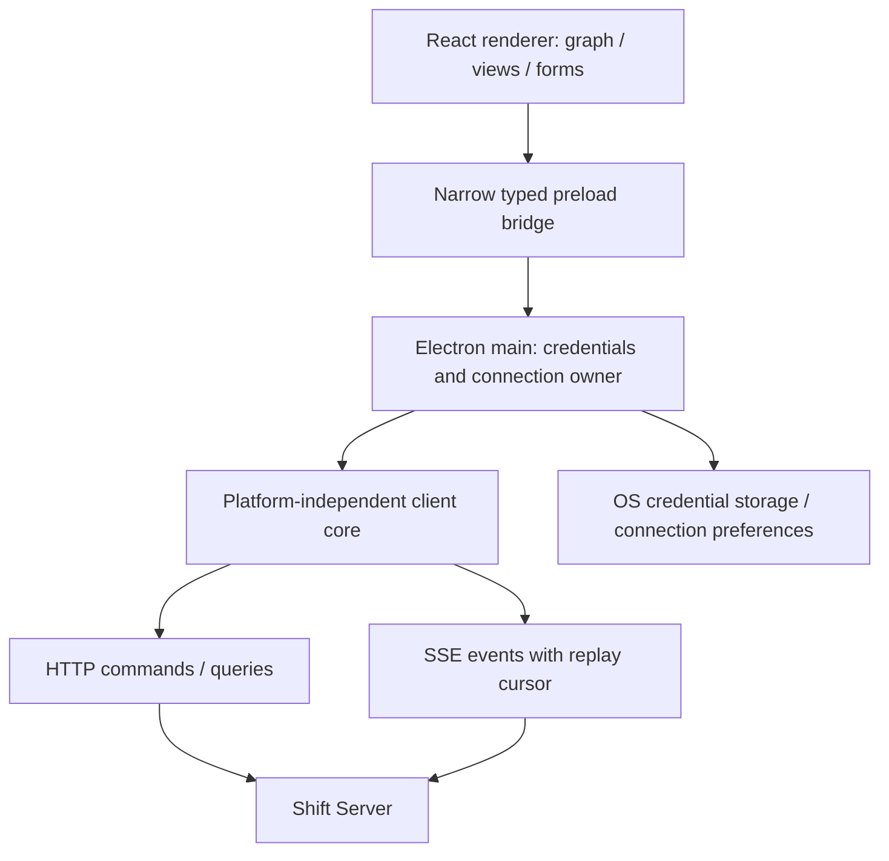

# Shift Client v0 technical specification and implementation plan

Status: proposed for approval. Date: 2026-10-01. This document specifies future implementation; no implementation is authorized yet. Read alongside [Shift Server v0](shift-server-v0.md), which owns the domain model, SQLite schema, and execution contracts. Decisions marked **v0 proposal** resolve previously unspecified details for approval.

## 1. Client contract and release scope

The v0 Shift Client is an Electron application for Windows, macOS, and Linux. It connects to a Linux Shift Server that owns repositories, harnesses, runs, schedules, and approval state. The client displays state, authors definitions, and submits commands. It never starts a local server or harness in v0, never runs a graph, and never owns a waiting interaction.

Take T3 Code's interface, project/session organization, remote connection model, and live agent visibility as references. Organize Shift around projects, workflows, runs, and addressable sessions. Workflow control is the primary experience. Manual conversations exist as explicit intervention or continuation of retained sessions.

Ship visual graph editing, typed forms/pickers, publication/version inspection, trigger configuration, run inspection, human forms/approvals, persistent session views, handoff/human reports, read-only file/diff inspection, settings, device management, and a durable attention inbox. Default configuration requires no JSON entry. Advanced mode may paste a whole node configuration. Result/input schemas have visual builders.

Defer native mobile, separately deployed web clients, a general code editor, interactive server terminal, local harness/server integration, multi-server simultaneous UI, visual parallel branches/joins, public custom-node installation, AI-generated workflows, shared-server roles, and offline mutation queues. Packages preserve future client boundaries without shipping empty applications.

## 2. Client architecture



**v0 proposal:** React, Vite, TypeScript, React Flow for canvas interaction, TanStack Query for renderer read caching, and schema-driven custom forms. A `client-core` module owns protocol validation, command correlation, event cursors, reconnect, and connection state through injected transport/storage interfaces. UI rendering and optimistic draft state live in `client-ui`. Initially these modules and Electron-specific credentials, desktop notifications, installers, and updates all live in the `apps/app/` workspace. Extraction into shared packages is deferred until needed.

The main process owns authenticated HTTP/SSE connections and obtains credentials from OS-backed storage. Preload exposes a narrow request/subscription interface. Renderer code does not receive bearer secrets, unrestricted Node APIs, arbitrary fetch credentials, or filesystem access. All repo/file/diff content comes through scoped server APIs. A future web client implements its own transport/credential boundary instead of importing Electron modules.

One connection supervisor owns retries per server. Components subscribe to its state; individual React screens do not independently reconnect streams. UI cache is derived state, not orchestration persistence. The server's database and event log remain authoritative.

## 3. Protocol dependency and stable client identities

The client uses shared runtime-validated wire schemas, not server repositories or executor implementations. Server IDs are stable through address changes; resource IDs and protocol/event versions are opaque. Sessions are identified by Shift IDs, never OpenCode IDs. Workflow/node type capabilities come from the connected server's catalog.

Every run view consumes its fixed workflow version and frozen configuration. Draft editing consumes the mutable draft and expected revision. A displayed run never quietly switches to the latest published graph. Profile/default changes affect future runs; the UI labels resolved configuration on existing executions.

Public client models include:

- Server info and capabilities; connection/device identity.
- Projects, workflows/drafts/versions, node catalog descriptions, profiles, and integration status.
- Runs and their cursor/state/wait/hold/cancel reason.
- Executions/attempts/inputs/outputs/errors and provenance.
- Shift sessions, normalized entries/invocations, lifetime/archive status, and linked runs.
- Human interactions with frozen forms and accepted responses.
- Artifact references/content; authenticated workspace status/files/diffs.
- Trigger subscriptions, cron previews, occurrences, overlap/catch-up settings.
- Command receipts, events, attention items, validation diagnostics, and resource-queue status.

The standard edge value is the server's `OutputEnvelope`: business `data`, session/artifact `references`, and handoff/workspace `context`. The UI makes business fields easy to select but preserves the full contract. Read-only structured-output inspection may show JSON. The restriction concerns normal configuration input, not inspection of recorded results.

## 4. Connection, pairing, and local storage

### 4.1 First connection

The first screen accepts server URL, temporary pairing phrase, and device name. The URL may be the free hostname pointing to the VPS or a user-supplied address. The client verifies HTTPS, reads server info/protocol range, submits enrollment, and saves the resulting device credential. It cannot replace enrollment with repeatedly storing the phrase.

Server URL normalization removes trailing slashes, rejects embedded userinfo and unsupported schemes, and keeps TLS verification enabled. **v0 proposal:** remote servers require HTTPS; loopback HTTP is permitted only for development. No click-through permanent certificate bypass in production. Custom CA support is a documented later feature unless required during implementation review.

After enrollment, reconnect with persistent credentials. Revocation clears the authenticated connection and requests pairing. Devices share owner authority, as specified for the server. Pairing/device management forms expose expiry, single-use status, and last-seen/revocation without showing other devices' credentials.

Enrollment has its own command ID so main can recover a lost response during the challenge's original lifetime. A matching retry retrieves the same issued device credential, not another enrollment. After expiry, show that a new phrase is required. Keep the phrase only for that pending enrollment in main-process memory and clear it after success/expiry.

**v0 proposal:** save one active server plus recent connection profiles; only one server is active in the UI in v0. Do not mix caches by URL. Key state by stable server ID, event epoch, device identity, and resource identity. Changing address prompts a server-identity check before reusing the saved credential. Enrollment identity checks protect against silently targeting a different server at an edited URL.

### 4.2 Credential storage

Main process uses Electron safeStorage/OS-backed credentials and stores encrypted bytes separately from nonsecret preferences. Keep tokens out of renderer memory, logs, crash reports, URLs, and clipboard defaults. Linux can fall back to an insecure backend, as documented in [safeStorage](https://github.com/electron/electron/blob/v44.5.1/docs/api/safe-storage.md). **v0 proposal:** if a secure secret service is unavailable, use a session-only credential and explain that re-pairing will be necessary after quitting. Do not silently persist plaintext. Offer secure-service setup instructions in settings.

Store URL/server ID/device ID, window preferences, draft recovery data, and the last event cursor locally. Cached private content is minimized. **v0 proposal:** metadata/attention summaries may survive restart; full transcripts/repo files/reports stay in memory by default and reload from the server. Locally recovered drafts are marked unsaved and never published automatically. Clearing a connection removes its credential/cache without cancelling any server run.

### 4.3 Reconnect and uncertain commands

Connection states are `unconfigured`, `connecting`, `pairing`, `online`, `offline`, `revoked`, and `incompatible`. Server readiness/recovery is a separate status. Offline screens can show their cached data with a visible last-updated time. Mutating controls are disabled when no live authenticated connection exists.

On reconnect:

1. Verify identity, protocol range, event epoch, and advertised capabilities.
2. Reconcile any pending command receipt by its original ID.
3. Obtain a consistent snapshot/high-water mark or replay from the valid saved cursor.
4. Apply ordered validated events; refetch affected aggregates where events are notifications rather than complete replacements.
5. Mark data live only after reconciliation completes.

Events are duplicate-tolerant by epoch/sequence. A new epoch, invalid cursor, or incompatible event version requires a fresh snapshot. One component cannot reorder an aggregate by applying an older query after a newer event; revisions and query watermarks guard cache updates.

Every mutation receives a new UUID command ID once. While its acknowledgement is uncertain, retry only that same operation ID/body or query the receipt. Never automatically replay all mutations on reconnect. In particular, a lost approval acknowledgement is shown as “Checking whether your response was saved” until the server confirms it. Another device's accepted decision replaces the stale form.

## 5. Information architecture and screens

Use a project sidebar inspired by T3's project/thread organization. Within a selected project, expose Workflows, Runs, and Sessions as separate resources. A global attention inbox collects human requests, uncertain recovery, exhausted limits, and actionable failures. Settings remains accessible outside a run.

### 5.1 Projects and settings

Project setup accepts a repository path on the server, selects its base ref, and configures defaults. The server validates/canonicalizes that path and verifies Git access. A local desktop directory chooser cannot register a VPS path. A host-directory browsing picker is deferred; workspace file inspection remains available after registration.

Settings includes:

- Server identity/connection/readiness, version compatibility, and hostname/HTTPS status.
- Device name, paired device list, enrollment phrase generation, and revocation.
- Project defaults, action permissions, agent profiles, installed harness/model capabilities, and concurrency/limits.
- GitHub App onboarding and verified installation/repository/permission status.
- Cron timezone defaults and preview; trigger credentials/status with explicit secret rotation.
- Read-only storage/backup/diagnostic status and links to local CLI administration.
- Desktop notification, appearance, accessibility, and update preferences.

Secret forms are write-only. Return configured/missing status and validation errors, not stored secret values. Selecting a harness/model/profile uses capabilities from the server. The client never assumes that an OpenCode installation exists locally.

GitHub setup can register a custom App once or choose an already configured App. Pick its verified installation and repository to bind to this project. Display the App-scoped webhook URL so using the same App for several projects does not require conflicting URLs/private-key copies. All App management still belongs to this self-hosted server.

### 5.2 Workflow list and publication

Display draft/published version, enabled/paused status, configured triggers, and recent runs. Workflow Pause prevents new runs and clearly states that active runs continue. Cancel is available on individual runs. Existing runs can receive human input even when the workflow is disabled.

Draft save uses compare-and-swap revision. Publish validates the graph on the server and creates an immutable version. Saving never changes active execution. Publishing displays what version new starts will use; configuration changes never rewrite a historical run graph. If another device saved the draft, show the conflicting versions and require explicit resolution rather than last-write-wins overwriting.

**v0 proposal:** local autosave for recovery and explicit server Save/Publish actions, with unsaved/conflict indicators. Add server autosave only after proving conflict behavior; neither autosave nor visual movement publishes automatically.

### 5.3 Run inspection

Show the fixed run graph, active node/wait, elapsed active time, loop/execution counts, outcome, and an ordered event timeline. Clicking a node selects an actual execution, not just its latest picture. Repeated passes have a selector ordered by execution sequence; attempts appear below the selected execution. Canvas badges summarize successful/failed visits without hiding earlier results.

The inspector includes resolved input, selected references and producing execution, configuration snapshot, result, selected port, error/retry details, session link, handoff/human report, artifact list, and Git/integration evidence. Session state and node execution state are distinct labels. “Agent is idle” never renders as “Node completed” unless the server committed completion.

Show expected waits as waits, intervention holds as holds, and uncertain recovery as actionable uncertainty. Queue position/resource owner comes from server state. Buttons send commands; animations do not advance the graph. Limit extension and retry show the recorded reason and target execution.

### 5.4 Human interaction and attention

Render the server's frozen form schema using supported typed widgets. Approval provides Approve/Reject and optional configured feedback. Generic forms support booleans, text, numbers, selections, and simple nested groups/arrays. Include the requesting workflow/run/execution, explanatory human report, and relevant selected artifacts.

Submit against the interaction revision and command ID. Only the server acknowledgement marks accepted. Disable duplicate clicks while pending but retain the command ID for receipt lookup. If another client responded first, show the accepted decision/device/time. Expired/cancelled interactions become read-only. A held run can accept a response while showing that advancement awaits resume.

The attention inbox is a server projection. A desktop notification is a link to an existing request, not a separate approval state. Opening a notification selects the relevant resource. Desktop delivery failure cannot erase it. If the app was closed, reconnect populates outstanding requests; configured workflow HTTP notification nodes provide external alerts independently.

### 5.5 Sessions and manual intervention

Sessions have a project view with stable Shift ID, harness, lifetime, workspace, last activity, archive state, and linked runs/executions. They remain visible after runs finish. Render normalized messages/tool activity and link invocation reports/results. Display provider IDs only in diagnostics, never in workflow selectors.

For a session owned by an active run, entering manual interaction requests a server hold. Explain whether active work must finish or be explicitly stopped. Enable the composer only once the server grants ownership. After manual messages, Resume returns control to the node's original completion contract. Standalone persistent session continuation claims its retained workspace through the server. Archived ephemeral sessions are read-only in v0.

Closing/disconnecting the client during an explicit intervention leaves the persisted hold in place. Reopening shows that hold and its resume action; the client does not silently resume work or cancel the run. Node business results remain distinct from the fixed completed/blocked/failed agent terminal status in inspection views.

Selecting “existing session” in node settings uses a project session picker or a typed earlier-output reference. Show workspace compatibility and queue implications. Never infer session reuse from node names, role names, or matching harness IDs.

### 5.6 Files, diffs, and reports

Read-only browser/diff views are scoped to server workspaces and show which run/session owns the workspace. Paths are server paths. Files are capped and large/binary files return metadata/download choices rather than trying to render arbitrary bytes. Display Git base/current commit/branch and mark live inspection as distinct from a recorded execution's artifact.

Render Markdown reports with raw HTML disabled and sanitized links. Do not execute scripts, embed privileged remote content, or treat report prose as state. Highlight handoff and human-report roles separately. Historical reports remain selectable even after later loop passes. External links open only after scheme validation through main process.

## 6. Visual workflow editor

### 6.1 Canvas model

React Flow provides interaction and layout coordinates. The authoritative graph remains the domain document. Source handles represent declared output port IDs; executable targets have one activation input. Connections use semantic IDs independent of canvas position.

Support add/delete/duplicate nodes, connect/reconnect edges, pan/zoom, fit-to-view, undo/redo, and a side inspector. Direct backward edges are allowed and visually distinguishable. Incoming convergence is allowed. Creating a second edge from the same output is rejected with an explanation that v0 supports one path per run. No “join” badge is inferred from incoming edge count.

Trigger nodes are start points, with no incoming execution edge. A workflow can contain several. Manual Start selects a published trigger entry and form input; it does not start every trigger. A run snapshot is inspectable but not editable through the run screen.

### 6.2 Forms and schemas

The server catalog supplies versioned machine schemas and UI descriptions. Build widgets for string/number/boolean, enum, optional/required, object groups, arrays, credentials/integration/profile/session selectors, retry/limit controls, prompts, and time/timezone fields. The initial result-schema builder supports nested objects/arrays, scalar types, enums, field descriptions, and required flags within server depth/size limits.

Normal operation never requires raw JSON. Node output/input reference selectors support literals, current input, trigger data, project data, and earlier node outputs. Show result fields and Shift resource references separately. Plain sequential data is already connected; mappings are additional configuration, not mandatory boilerplate on every edge.

Conditions use typed comparison widgets and AND/OR groups. Switch uses ordered cases and a default. Literal/reference types guide the editor; unknown optional values remain valid when configured with explicit fallbacks. Include run-variable pickers and Set/Get Variable forms, clearly labeling producing revision and snapshot semantics. Prompt editors insert references as readable tokens whose stored representation is a ValueSource, not ambiguous prose substitution. Resource references are selected as resources, not guessed from pasted harness IDs.

Agent settings expose profile/harness/model/instructions, result schema, report toggles, handoff source selection, session strategy, and persistent/ephemeral lifetime. The visual result-schema builder describes successful business data; Shift's terminal completion/blocker envelope is automatic. Explain the three session strategies and prohibit ephemeral combinations the server does not support. Any required unsupported harness capability becomes a diagnostic before execution.

Cron setup offers familiar schedule controls plus an expression text field and timezone picker. An expression is a typed field, not JSON. Preview comes from the server's actual parser/policy. Human input setup builds the frozen form. Command arguments, HTTP headers/body fields, and output transformations use field/repeater widgets. Advanced Script is available only in Advanced mode with an explicit code editor; ordinary transformation uses forms.

### 6.3 Advanced node configuration

Advanced mode permits pasting a complete node configuration conforming to its catalog schema. Parse, validate, preview changes, and require Apply. Invalid input does not replace the current node. Treat node identity/position/edges as editor-owned fields; pasted config cannot silently create connections, switch projects, or alter a published run. Do not silently discard unsupported fields.

After applying, normal forms can edit supported values. If Advanced configuration uses a supported server capability outside the form subset, show that portion as Advanced-only rather than corrupting it on the next form save. Config import cannot execute code. Publishing remains a separate server command.

### 6.4 Validation and accessibility

Client validation provides quick feedback; server validation is authoritative at save/publish/start. Diagnostics identify node, field, port, and connection. Validate uniqueness, type/version support, port fan-out, schema shapes, session policy, references, required configuration, and integrations. Backward edges are valid; unreachable nodes and optional unconnected outcomes are warnings where appropriate.

Keyboard workflows must support adding/selecting/configuring/deleting nodes and connecting named ports through accessible controls, not only dragging. Provide a list representation of nodes/edges beside the canvas. State is conveyed by text/icons as well as color. Preserve focus during event updates. Respect reduced motion, zoom/font preferences, and screen-reader names. Large graphs use bounded rendering/virtualized histories; exact performance budgets are verified with representative graphs during M07/M15.

## 7. Client contracts and transport boundary

```ts
interface ServerProfile {
  localId: string; url: string; serverId?: string; deviceId?: string;
  credentialHandle?: string; // main-process storage reference, never token
}

interface ClientTransport {
  query<T>(request: ProtocolQuery<T>): Promise<T>;
  command<T>(request: ProtocolCommand<T>, commandId: string): Promise<T>;
  receipt(commandId: string): Promise<CommandReceipt | undefined>;
  events(cursor?: EventCursor, signal?: AbortSignal): AsyncIterable<ProtocolEvent>;
}

interface ConnectionRuntime {
  connect(profileId: string): Promise<void>;
  disconnect(): Promise<void>; // affects client transport only
  subscribe(listener: (state: ConnectionState) => void): () => void;
  query<T>(request: ProtocolQuery<T>): Promise<T>;
  mutate<T>(request: ProtocolCommand<T>, commandId: string): Promise<MutationOutcome<T>>;
}

type MutationOutcome<T> =
  | { kind: "confirmed"; value: T }
  | { kind: "rejected"; error: ProtocolError }
  | { kind: "acknowledgement_unknown"; commandId: string };

interface DesktopBridge {
  connection: {
    listProfiles(): Promise<PublicServerProfile[]>;
    connect(profileId: string): Promise<void>;
    pair(request: PairingForm): Promise<PublicServerProfile>;
    subscribe(listener: (event: DesktopConnectionEvent) => void): () => void;
  };
  protocol: {
    query<T>(request: ProtocolQuery<T>): Promise<T>;
    command<T>(request: ProtocolCommand<T>, commandId: string): Promise<MutationOutcome<T>>;
  };
  desktop: {
    openExternal(url: string): Promise<void>;
    notificationPreference(enabled: boolean): Promise<void>;
  };
}
```

Generic TypeScript examples are descriptive; runtime schemas still validate every IPC and server payload. Main validates the sender/frame, active connection, endpoint allowlist, input size, and protocol discriminant. A renderer cannot turn the bridge into arbitrary filesystem/network access. Subscription teardown and bounded message queues prevent stale views from retaining streams indefinitely.

## 8. Security, compatibility, and packaging

Electron runs bundled application UI through a controlled custom scheme. Enable `contextIsolation`, renderer sandboxing, CSP, and `webSecurity`; disable renderer Node integration. Preload uses `contextBridge` with narrow validated operations. Reject unexpected navigation/window creation, validate IPC senders, and validate external-link schemes. These boundaries follow [Electron security guidance](https://www.electronjs.org/docs/latest/tutorial/security). Remote reports and repo contents are untrusted display content even when the owner authorized the workflow.

**v0 proposal:** target macOS 13+ on x64/arm64, Windows 10+ x64, and supported Ubuntu/Debian desktop distributions on x64 initially. Linux server binaries target glibc Linux x64/arm64. Broader Linux packaging and Windows/Linux arm64 desktop artifacts are later packaging additions. All three operating-system families must have CI/build/smoke coverage; Electron's theoretical support is not equivalent to tested Shift support.

Use an actively maintained Electron release pinned at implementation time. At research time Electron 44.5.1 supports the proposed baseline. Build packaging on matching OS runners, sign Windows artifacts, and sign/notarize macOS. Publish Linux packages/AppImage with integrity metadata and installation instructions. Signing identities and platform CI runners are release prerequisites.

v0 desktop update policy is explicit download/install notification. Automated update installation is deferred; manual desktop replacement cannot interrupt server workflows. Compatibility is negotiated independently of matching release numbers. A client refuses unsupported mutation protocols/type versions with a clear upgrade message, while safe read-only inspection may be allowed if advertised. Unknown events cause resnapshot/refetch, not guessed state transitions.

The client does not silently update the server or harness. Server service/backup/restore administration remains CLI-first, with status/documentation in settings.

## 9. Verification and release acceptance

Test `client-core` with deterministic fake transport, duplicate/out-of-order delivery, epoch changes, connection loss after command commit, revoked credentials, delayed queries, and server revision conflicts. Test forms against catalog schemas and ensure normal workflows need no raw JSON. Test IPC validation and credential omission from renderer/logs.

UI/component tests cover graph edge constraints, valid backward edges, reference pickers/history, visual result-schema authoring, form conflicts, immutable run graphs, loop execution selection, attention submission races, uncertain receipts, and report sanitization. Use a fake server fixture, then the integrated server. Packaged Electron smoke tests run on Windows/macOS/Linux. Browser-based component testing is implementation tooling, not a separately shipped web product.

Acceptance demonstrations:

- Pair with a VPS, author a general graph entirely through forms/pickers, publish, and start it.
- Inspect a repeated node's executions/attempts and the persistent session it reused.
- Approve a waiting form, lose connection immediately, reconnect, and see the persisted decision/progress.
- Close Electron while work runs; reopen and catch up from server state.
- Observe and intervene in an agent session through explicit ownership/hold, then resume.
- Read immutable human/handoff reports, source files, and a diff without local repository access.
- View a run's old graph after publishing a new version, without switching its meaning.
- Receive desktop attention notification when connected and see outstanding requests after being closed.
- Apply an Advanced whole-node config paste only after validation; ordinary authoring remains form-based.
- Install a packaged build on each supported OS family and connect to the same server protocol.

## 10. Primary-source grounding

Retrieved 2026-10-01. Source behavior informs implementation constraints; Shift semantics remain those specified above.

- [T3 remote architecture](https://github.com/pingdotgg/t3code/blob/main/docs/internals/remote.md) and [connection runtime](https://github.com/pingdotgg/t3code/blob/main/docs/internals/connection-runtime.md). Remote-only desktop mode and one connection supervisor fit Shift's client boundary.
- [Electron security](https://www.electronjs.org/docs/latest/tutorial/security), [sandboxing](https://www.electronjs.org/docs/latest/tutorial/sandbox), and [context isolation](https://www.electronjs.org/docs/latest/tutorial/context-isolation).
- [Electron 44.5.1 platform support](https://github.com/electron/electron/blob/v44.5.1/README.md#platform-support), [safeStorage](https://github.com/electron/electron/blob/v44.5.1/docs/api/safe-storage.md), [signing](https://github.com/electron/electron/blob/v44.5.1/docs/tutorial/code-signing.md), and [autoUpdater](https://www.electronjs.org/docs/latest/api/auto-updater). Linux credential/update behavior differs from macOS/Windows.
- [React Flow custom nodes](https://reactflow.dev/learn/customization/custom-nodes), [handles](https://reactflow.dev/learn/customization/handles), [connection validation](https://reactflow.dev/examples/interaction/validation), and [save/restore](https://reactflow.dev/examples/interaction/save-and-restore). Canvas serialization is not the Shift workflow definition or execution engine.

## 11. Implementation roadmap and server coordination

Use the integrated milestone order in [the server roadmap](shift-server-v0.md#18-ordered-implementation-roadmap). Both files describe one implementation sequence, not two competing dependency orders. Each milestone leaves the repository buildable/testable and adds the demonstrable behavior listed there.

| Milestone | Client work and completed behavior |
| --- | --- |
| M01 | Electron main/preload/renderer shell, package boundaries, security defaults, and three-platform build/smoke setup. No local server launch. |
| M02-M04c | Protocol/catalog/form fixtures and client-core tests against definition, execution, variable, failure and wait contracts while the server develops. Avoid implementing a second engine in the client. |
| M05 | Main-process transport, secure credential adapter, command correlation, event cursor/snapshot behavior, pairing fixtures. |
| M06 | Connect/pair, project/workflow/run/session navigation, server-backed attention forms/reports, offline/revoked/incompatible states, settings shell. |
| M07 | React Flow editor, basic forms, edges/diagnostics, server save conflicts, publish/version selection/manual start. A simple branch graph works without JSON. |
| M07a | Reference/schema builders, variable/session configuration, local draft recovery and richer human/limit forms. Author loops/waits with fake dependencies. |
| M08-M08a | Workspace/session strategy pickers and resource-state presentation, including retained sessions, fake reports and incompatibility diagnostics. |
| M09-M09b | Live real agent activity, terminal/report/handoff inspection, invocation history and restart/reconnect observations. |
| M10-M10a | Command/HTTP/Script/Git node forms and structured outputs from registry descriptions. |
| M11-M11b | GitHub App onboarding/settings, missing-capability diagnostics, PR/check/merge/event node forms. No implicit merge verification. |
| M12-M12a | Cron timezone/schedule preview, overlap/misfire policy forms, occurrence history, authenticated webhook setup. |
| M13 | Intervention hold/stop/resume, read-only file/diff inspection, detailed histories, Advanced config paste, attention and desktop notifications. |
| M14-M14c | Windows/macOS/Linux packaging, credentials on real platforms, signing/notarization, restore resnapshot, optional hostname onboarding/status and HTTPS guidance. |
| M15 | Packaged fault/reconnect/conflict/accessibility/performance tests and end-to-end general-workflow/maintenance demonstrations. |

Do not implement any milestone until the owner approves both specifications. Release prerequisites are operator-owned DNS, signing credentials, and a test GitHub App; they are not permission to deploy from this documentation task.
