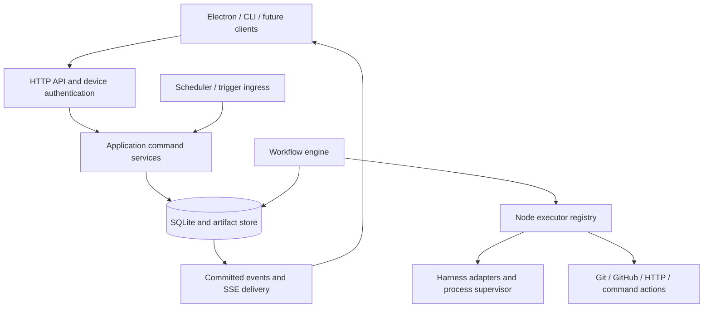

# Shift Server v0 technical specification and implementation plan

Status: proposed for approval. Date: 2026-10-02. This document specifies future implementation; no implementation is authorized yet. Read alongside [Shift Client v0](shift-client-v0.md). The decisions marked **v0 proposal** resolve details left open during the interview and are included in the approval requested for these specifications.

## 1. Product contract and scope

Shift is a self-hosted control plane for arbitrary, durable workflows. Models perform bounded work; Shift owns execution, scheduling, authority, persistence, human interactions, and recovery. A maintenance pipeline is an acceptance scenario, never an engine primitive.

The server runs on Linux in v0. Repositories, harness authentication, commands, and agent processes live on its host. Windows, macOS, and Linux Electron clients are remote interfaces. Closing every client has no effect on execution. One person can pair several devices. All paired devices have owner authority; v0 introduces neither cloud accounts nor multi-user roles. Sharing a server is possible under that shared authority.

Implement these capabilities in v0:

- Project-owned visual workflow definitions, drafts, immutable published versions, and persisted runs.
- One execution path per run, with multiple runs permitted under server concurrency limits.
- Conditions, switches, direct backward edges, explicit references, bounded retries, error paths, and explicit end outcomes.
- Persistent and ephemeral sessions through a generic harness contract, with OpenCode as the first adapter.
- Structured agent results, agent handoffs, human reports, and invocation-specific artifact storage.
- Durable human forms/approvals, timers, integration waits, resource queues, and intervention holds.
- Manual, cron/schedule, authenticated HTTP webhook, and GitHub event triggers.
- Shift-owned Git, GitHub, HTTP, command, and data-transformation actions.
- Device enrollment/revocation, HTTP API, replayable server events, service installation, and a free hostname option.

Defer parallel paths/forks/joins, subworkflow invocation, cross-project runs, distributed workers, additional harness implementations, a node marketplace, general plugin installation, native mobile/web distributions, a relay, automatic code rollback, automatic artifact/session pruning, automatic server upgrades, billing, and organizational roles. Arbitrary v0 graphs can combine the shipped primitives without a maintenance-specific controller.

## 2. Decisions that would be expensive to change

| Decision | v0 resolution and reason |
| --- | --- |
| Graph format | A versioned JSON domain document is authoritative. Renderer positions are presentation data. React Flow serialization never defines runtime behavior. |
| Execution identity | Runs, node executions, attempts, agent invocations, and sessions have separate IDs and lifetimes. |
| Data contract | Every edge carries one output envelope. Arrays are values. Agent result schemas describe business data, not Shift metadata. |
| Branching | One chosen port and at most one edge for that port. Canvas position never determines execution. |
| Versions | Publishing freezes graph and node type versions. Starting freezes resolved profiles/defaults and trigger input. |
| State authority | SQLite records state transitions and operations; messages and process memory are observations. |
| External effects | Durable intent, external execution, then durable completion. No blanket exactly-once claim. |
| Session addressing | Shift IDs are public references. Harness IDs and process handles remain adapter details. |
| Workspace ownership | **v0 proposal:** workspaces are retained project resources, separate from sessions and runs. Default runs receive isolated detached worktrees. |
| Session reuse across runs | **v0 proposal:** reuse requires explicitly attaching a run to the session's existing workspace. Sessions cannot silently change working directory. |
| Extension contracts | Version node executors, node definitions, graph documents, event payloads, and the wire protocol independently. |
| Action authority | Approval grants broad task authority. Project permissions control available orchestration actions. Merge has no implicit review/CI gate. |
| Client/server transport | HTTP commands and queries plus resumable SSE events. Durable receipts and replay are application contracts, independent of transport. Future bidirectional streams can add WebSockets without replacing these interfaces. |
| Hosted dependency | The optional hostname service provides DNS only. Execution, pairing, and credentials belong to the user's server. Direct access always works. |

## 3. Modules and ownership



- **Engine:** selects eligible work, resolves inputs, advances the single cursor, enforces execution limits, and commits transitions. It imports no Express, OpenCode, GitHub SDK, or Electron code.
- **Scheduler:** enumerates occurrences, wakes durable deadlines, and submits run-start commands. It does not execute graphs.
- **Node executors:** perform one node's behavior under its registered contract. A control node selects a declared port. An executor never recursively starts another graph node.
- **Harness adapter:** manages a harness conversation, submits correlated invocations, inspects durable messages/results, observes activity, and attempts cancellation. It knows nothing about workflow routing.
- **Process supervisor:** owns host processes, endpoints, logs, health probes, and verified recovery handles. Client connections do not own its lifetime.
- **Actions:** implement Git/integration effects and their reconciliation. GitHub event ingress is separate from outgoing GitHub actions.
- **Persistence:** synchronous, short transactions over SQLite; content-addressed artifact storage; migrations; backups. Filesystem/network calls are outside transactions.
- **Application services:** enforce device/project authorization, validate commands, and combine repository transitions. API/CLI and scheduler call these same services.
- **API:** parses HTTP, authenticates, maps errors, and serves validated protocol data. It is an adapter to application services.
- **Realtime:** streams committed events and repairs gaps through snapshots. Notification delivery is independent of human-request state.

One server process owns one database. **v0 proposal:** Node 24 LTS, pnpm workspace, TypeScript strict mode, Express, better-sqlite3, and Ajv with JSON Schema 2020-12. Pin actual package versions during the approved foundation milestone. Use a patched SQLite build, at least 3.51.3 or a documented equivalent backport. Native SQLite stays in the Linux server, never the Electron bundle.

## 4. Domain model

IDs are opaque UUIDs with optional display prefixes. They carry no workflow meaning. Times are UTC epoch milliseconds; API times also have an ISO representation. Counters and event cursors are protocol integers with explicitly bounded safe ranges. Every mutable aggregate has a revision for compare-and-swap commands.

### 4.1 Definition resources

- **Project:** canonical registered Git repository path, base ref, defaults, action permissions, agent profiles, integration references, and archive state. Register existing host repositories in v0. Cloning can use an explicit Git action or CLI setup operation.
- **Workflow:** project-owned identity, name, draft document/revision, enabled flag, and active published version. Workflow Pause changes `enabled` and disables future starts only.
- **WorkflowVersion:** immutable graph, document format version, numbered revision, hash, node type versions, input schema, and publishing device/time. Editing a draft or publishing a replacement never changes an existing run.
- **NodeDefinition:** stable ID within a version, executor type/version, config, input bindings, session policy if applicable, retries/limits, and UI position.
- **Connection:** source node/output port and destination node/input port. v0 has one incoming activation port per executable node. Distinct outcomes may converge on the same node.
- **NodeTypeDefinition:** installed registry entry describing config/result schemas, UI field descriptions, available ports, permissions, and execution capabilities. Published versions pin the type version; retain required old implementations or reject a deployment that removes them.
- **AgentProfile:** project-owned harness/model/system instructions/tool-policy defaults. Nodes can override allowed settings. Runs snapshot resolved effective configuration, excluding secret values.

### 4.2 Runtime resources

- **Run:** project/workflow/version IDs, frozen effective definition, trigger input, entry node, cursor, primary workspace, state/wait reason, hold/cancel intent, counters, timestamps, and outcome. A run uses one path, not a global workflow program counter.
- **NodeExecution:** one activation of a node. Records predecessor execution/edge, monotonically increasing run sequence, resolved immutable input/bindings and their provenance, configuration snapshot, selected port, output/error, and session binding. A deliberate loop creates another execution.
- **NodeAttempt:** a physical attempt under one execution. Retries preserve its input and session binding; attempts have their own timestamps, errors, logs, and effect/invocation records. Contract corrections are invocations within an attempt rather than graph loops.
- **Cursor:** the durable next activation or current node/wait. Only a transaction can replace it. Node completion and scheduling the successor are one transaction.
- **RunControl:** persisted intervention hold, previous resumable state, device/reason, and any cancellation request. It is separate from workflow enablement.
- **RunVariable:** an explicitly written run-local JSON value with revision and producing execution. Writes and their history commit with the producing node's result; they are separate from agent context and project defaults.
- **Workspace:** retained working directory plus project/base commit/branch information and lifecycle. Agents and Git nodes address a workspace reference.
- **ResourceLease:** exclusive ownership of a workspace or session with holder, server generation, fence, and durable queue order. Lease expiration alone never proves a former external process stopped.

### 4.3 Sessions and artifacts

- **AgentSession:** project-owned Shift identity, harness binding, workspace, effective configuration, persistent/ephemeral lifetime, session state, creation/archive metadata. It can participate in many node executions and runs.
- **HarnessSession:** mapping from an AgentSession to the harness-specific ID, adapter/version, resume metadata, and latest verified runtime generation. An unexpected missing mapping is a blocker, not an invitation to start a new conversation.
- **HarnessRuntime:** supervised process identity and verified reconnect information. A runtime can stop while its persisted harness session remains resumable.
- **AgentInvocation:** one submitted goal, correction, recovery continuation, or manual message. Records its Shift ID, execution/attempt if any, exact prompt/context references, harness correlation ID, submission uncertainty, and result. Node success is determined from its contract, not from `idle` status.
- **SessionEntry:** normalized durable conversation/tool activity, keyed by stable provider message/part identity and revision. The adapter retains enough raw metadata to reconcile messages after a disconnected stream.
- **Artifact:** immutable stored bytes, media type, SHA-256, size, producing run/execution/attempt/invocation/session, semantic role, and display filename. Filename is a label, never a global storage location.

### 4.4 Human, integration, and control resources

- **HumanInteraction:** one waiting execution's frozen form, presentation/report references, deadline if any, state, and accepted response. Approval is a specialized form with named outcomes. Responses are append-only records with device and command IDs.
- **Trigger:** active configuration derived from a published trigger node. Runtime identity belongs to its workflow/project; publication atomically updates future trigger subscriptions.
- **TriggerOccurrence:** deduplicated incoming event or cron instant, captured version/input, admission outcome, and optional resulting run. Accepting a trigger and starting/queuing/skipping its run are recorded atomically.
- **GitHubApp / Installation / IntegrationConnection:** server-owned user-created App registration and installed-account identity, plus project-owned repository binding. One custom App can serve several projects through its single webhook endpoint; connection records never duplicate its private key. No hosted Shift account is involved.
- **GitHubDelivery:** verified App delivery receipt and captured subscription matches. Deduplicate before fan-out to project triggers so redelivery cannot pick up newly published subscriptions.
- **Credential:** encrypted server-side private keys, webhook secrets, and harness transport secrets. Workflows/profile snapshots contain references only.
- **EffectOperation:** intended external action with execution/attempt, stable operation key, argument hash, lifecycle, correlation evidence, and recovery result.
- **DurableJob:** runnable activation, wake-up, delivery, cancellation, or reconciliation task. Jobs carry references to authoritative state, not independent workflow state.
- **Device / PairingChallenge:** revocable owner-device credential and temporary single-use enrollment challenge.
- **CommandReceipt:** idempotency key, actor, request hash, and committed response for mutating client commands.
- **Event:** ordered immutable fact committed alongside state. It is an audit/delivery history; v0 is not an event-sourced engine.

## 5. Graph document and data contract

```ts
type Json = null | boolean | number | string | Json[] | { [key: string]: Json };
type ResourceRef<K extends string> = { kind: K; id: string; projectId: string };
type SessionRef = ResourceRef<"agent_session">;
type ArtifactRef = ResourceRef<"artifact">;
type WorkspaceRef = ResourceRef<"workspace">;

interface OutputEnvelope {
  data: Json;
  references: { agentSession?: SessionRef; artifacts: ArtifactRef[] };
  context: { handoffs: ArtifactRef[]; workspace?: WorkspaceRef };
}

type ValueSource =
  | { kind: "literal"; value: Json }
  | { kind: "input"; path: string[] }
  | { kind: "trigger"; path: string[] }
  | { kind: "project"; path: string[] }
  | { kind: "variable"; key: string; path: string[]; optional?: boolean; fallback?: Json }
  | { kind: "node"; nodeId: string;
      execution: "latest" | "first" | { sequence: number } | { executionId: string };
      path: string[]; optional?: boolean; fallback?: Json };

interface WorkflowDocument {
  formatVersion: 1;
  execution: {
    workspace: { kind: "new" } | { kind: "existing"; workspace: WorkspaceRef }
      | { kind: "session_workspace"; session: SessionRef };
    overlap: "skip" | "queue" | "allow";
    limits: { maxExecutions: number; maxActiveMs: number };
  };
  nodes: NodeDefinition[];
  connections: ConnectionDefinition[];
  presentation: { viewport?: { x: number; y: number; zoom: number } };
}

interface NodeDefinition {
  id: string; type: string; typeVersion: number;
  config: Json;
  bindings: Record<string, ValueSource>;
  retry: { maxAttempts: number; initialDelayMs: number; maxDelayMs: number };
  limits: { maxExecutionsPerRun: number };
  position: { x: number; y: number };
}

interface ConnectionDefinition {
  id: string; fromNodeId: string; fromPort: string;
  toNodeId: string; toPort: "input";
}
```

This is the serialized domain format, not an instruction that users must write JSON. The normal client uses forms/pickers. Advanced mode can paste a whole node configuration. The editor offers a result-schema form builder for object fields, arrays, scalar types, enums, and required fields.

The agent result schema validates `output.data` only. Shift constructs references/context. Downstream nodes receive the entire envelope automatically; the picker presents `data` fields conveniently. Control nodes pass the incoming envelope through unchanged unless explicitly configured otherwise. Data/action nodes publish their declared new data and preserve incoming handoff/workspace context. They do not silently merge arbitrary preceding business data into their result. Authors reference earlier nodes when additional data is needed.

An agent publishes its newly collected handoff as the current handoff. Additional selected handoffs can be appended explicitly. Disabling handoff generation requires configuring downstream expectations; no imaginary artifact reference is produced. Session references are typed metadata and available through normal output references. Neither clients nor agents may fabricate an adapter mapping.

**v0 proposal:** core schemas use JSON Schema 2020-12, no coercion/default insertion/removal during validation, no remote `$ref` resolution, and a documented supported subset for agent result schemas. An adapter rejects unsupported result schemas before submission. Limit inline values to 1 MiB and node config/schema depth to 32; large content uses artifact references. All size failures are explicit.

## 6. Execution semantics

### 6.1 Admission and activation

1. A trigger or manual command captures the active version and its input. Resolve effective project/profile/node configuration into a run snapshot.
2. Apply enablement and overlap policy. Disabled workflows reject manual starts and record automatic occurrences as skipped. Existing runs, responses, and recovery remain eligible.
3. A job activates the entry trigger node as a completed execution carrying the trigger envelope, then follows its sole success connection. A workflow may have several trigger nodes, each an independent entry point; a run chooses one.
4. Resolve all bindings against the predecessor chain, snapshot them, allocate an execution sequence, bind its workspace/session if needed, and claim its attempt in a transaction.
5. Perform external work outside the transaction. Commit outcome, output, events, and successor job together. A repeated completion callback for the same attempt cannot schedule another successor.

Exactly one cursor and at most one active node execution exist per run. Other runs may operate concurrently. **v0 proposal:** server defaults to four active executions and two active agent invocations, configurable in settings. Queued work is durable.

### 6.2 Branches, incoming edges, and endings

- Generic Agent/data/action nodes select `success` on successful completion. Agent data cannot override the selected port.
- Condition selects `true` or `false`; Switch evaluates ordered configured cases and selects the first match or `default`; Approval selects `approved` or `rejected` after a committed response.
- Each source port has at most one outgoing edge. Two edges from one selected port are a publish error, not a sequential fan-out. Parallel paths require a future format/capability.
- A target may have several incoming edges. It executes when the current path reaches one, receiving that edge's source output. It does not wait for other incoming edges.
- A selected port without an edge is a successful leaf. End may declare `COMPLETED` or `FAILED` with an explicit outcome/reason. Completion is unrelated to PR/merge milestones.
- Optional `error` edges receive a machine-readable error envelope and preserved context. The producing execution remains failed in history, while its run may continue along that edge. Unhandled failure stops the run.

### 6.3 Loops and references

A backward edge is an ordinary activation and creates another NodeExecution with a larger sequence. All versions of inputs/results remain immutable. A retry creates another NodeAttempt under the same execution and frozen input. Corrections create additional AgentInvocations within an attempt. Recovery continuation closes a confirmed interrupted attempt and creates the next attempt with the same input/session, counting against its limit; the new invocation links to the interrupted invocation. Manual abort/resume follows the same accounting. Reconnecting to work that is still running does not create another attempt.

`latest` means the greatest earlier sequence for that node whose execution successfully completed and lies on the current execution's predecessor chain. The chain includes earlier loop passes. It can therefore return a value produced on an earlier pass even if that node did not execute during the newest pass. The editor labels the producing execution/sequence. Failed results are available through explicit execution-history/error inspection; they do not replace `latest` successful output.

`first`, sequence, and execution-ID selectors must also point to earlier executions in the same run/path. They cannot reference future work. Cross-run session reuse uses an explicit project session reference, not cross-run output expressions. History queries can inspect failed executions and all attempts without making them normal data references.

Missing required references and missing required object fields fail before invoking the executor. Optional references define a fallback. Resolution never runs a producer. Fallback applies only to missing values, not to malformed values or permission/compatibility errors. JSON paths are token arrays, never arbitrary JavaScript evaluation.

An optional binding must specify its fallback explicitly, including `null` where intended. Project-data bindings resolve from the run's frozen public project/default snapshot. Attempt retry and wait resume load stored bindings rather than resolving current project data again.

Run variables are explicit state, written by Set Variable and read by bindings or Get Variable. Persist current values and immutable revisions; record a write with its execution's successful completion. Resolve variable values once when preparing an execution and store them in `bindings_json` with provenance. Retries/resumes use that snapshot rather than rereading a newer value. Failed attempts do not partially commit variable writes. No implicit mutable workflow-wide object is shared among executors.

### 6.4 Session strategies and lifetime

Agent config independently selects:

- `fresh`: create a Shift/harness session for each new node execution.
- `per_run`: look up the unique binding for run/node; create once, then reuse on later visits.
- `reference`: resolve an explicitly selected project SessionRef.

Allocate/bind the Shift session in a transaction before creating its external harness conversation. Persist the operation intent and mapping so a crash between these steps can reconcile the creation. Session-creation uncertainty is handled like any other external effect. The adapter may use Shift correlation in harness metadata only where supported.

The execution's session stays fixed across attempts. A missing/unrecoverable session enters `NEEDS_HUMAN`; changing to a fresh session is an explicit repair/fork action, recorded in history, not an automatic retry.

Record the replacement as a repair override linked to the former session, and apply it to subsequent attempts/per-run bindings only after owner confirmation. Preserve the original config and previous invocation/session links. Sessions still cannot move between workspaces.

Persistent sessions survive execution/run completion and idle process shutdown. They can remain idle for days while a run waits. Ephemeral sessions retain result/report/history references but are archived after their execution finishes. **v0 proposal:** ephemeral lifetime requires `fresh` strategy; an archived ephemeral session cannot receive further goals without an explicit promote/unarchive operation. Promotion is deferred in v0, so continuation requires persistent lifetime.

Each session has one active invocation owner at a time. Other work queues durably. A workspace claim precedes a session claim in a fixed acquisition order. Queued invocations release worker slots. Conversation compaction is a harness behavior; Shift persists submitted goals and artifacts and never promises unlimited model context.

Cancellation that is session-wide holds ownership until the stop is acknowledged/accounted for; a delayed abort cannot race with a newly submitted invocation. If an adapter cannot establish that old work stopped, retain the claim and request reconciliation rather than handing the session to another caller.

### 6.5 Handoffs and result completion

Default prompts explain unattended execution, broad authorized intent, blocker reporting, required result schema, and the two reports. Agents resolve low-risk ambiguity independently and terminate with a structured blocker when they cannot proceed. Harness permission/question events cannot wait invisibly. In v0 the adapter stops/accounts for the invocation and reports a structured blocker; an author-configured error path can enter a Human Input node. It does not create an untracked prompt or synthesize an implicit approval gate inside the agent conversation.

The harness validates a fixed Shift terminal envelope: `{ status: "completed", data: <node-schema-value> }`, `{ status: "blocked", blocker: { code, message, details? } }`, or `{ status: "failed", error: { code, message, details? } }`. AgentService builds that discriminated schema around the author's business schema. Only completed data becomes successful `OutputEnvelope.data`. This lets an agent report a blocker without inventing required success fields such as a branch name. It cannot invent graph ports; business decisions still go through Condition/Switch. A blocker retains its original cause if reports could not be completed, rather than being relabeled as a success-schema error.

Every invocation receives its own artifact directory with the default filenames. Collect files using contained paths, verify existence/size, atomically ingest bytes, then attach immutable artifact records. The next agent receives selected handoff bytes or an explicit readable file plus instructions. Human reports render in clients. A reused session still receives the new goal, incoming data, and handoff; existing conversation is not the sole source of current intent.

Read-only/reasoning profiles can permit artifact-directory writes while restricting repository edits only where the adapter supports that tool policy. Required unsupported enforcement blocks invocation; role wording alone is not an enforced filesystem restriction. The successful terminal invocation's reports supply the node's default output handoff/human report; earlier correction/manual reports remain linked in history.

Validate the structured result independently of the harness result. A successful turn without valid data/reports is incomplete. **v0 proposal:** two contract-correction invocations by default, configurable per node. Correction exhaustion fails the node; partial artifacts remain inspectable. An agent-reported blocker is a structured executor error with optional error routing. A review decision such as `changes_requested` is valid successful business data.

### 6.6 Human waits, holds, and cancellation

Create the human interaction, frozen form, execution wait state, event, and absence of a runnable successor in one transaction. Approval output preserves the input envelope and adds the accepted decision/fields through its documented data wrapper; the successor requires no manual basic wiring. Generic Human Input similarly returns `{ input: previous.data, response: fields }` while preserving context.

Responses validate against the frozen form and expected interaction revision. The first accepted response wins. Persist response, state change, command receipt, event, and wake-up job atomically before acknowledging. A client can disconnect immediately. A repeated command returns its stored receipt; another conflicting response returns `409` with authoritative interaction state. Cancelled/expired requests return `410`. Indefinite wait is the default; optional timeout selects a declared `timeout` route or fails if unhandled.

Workflow Pause changes admission only. Cancel sets run cancellation intent, closes pending interactions/deadlines, stops further activations, and requests best-effort interruption. `CANCEL_REQUESTED` remains visible until active work is accounted for. If an effect's outcome is uncertain, retain the cancellation intent while entering `NEEDS_HUMAN`. Eventually `CANCELLED` records what completed before cancellation. Cancellation never rolls back prior external effects.

Manual intervention sets a durable run hold before any prompt. Let the active invocation finish or explicitly abort it; only after its outcome is accounted for can manual messages acquire that session. Resume returns to the original node contract, with intervention messages recorded. Manual messages cannot commit graph output directly. While held, approval responses can be persisted but advancement waits. A workflow's disabled flag does not block these existing-run operations.

### 6.7 State and limits

Run states: `QUEUED`, `RUNNING`, `WAITING`, `HELD`, `NEEDS_HUMAN`, `FAILED`, `CANCEL_REQUESTED`, `CANCELLED`, `COMPLETED`. `WAITING` carries `human`, `timer`, `integration`, `session`, `workspace`, or `retry` plus its resource/deadline. This avoids encoding each future wait type as a new run state.

Execution states: `PENDING`, `RUNNING`, `WAITING`, `COMPLETED`, `FAILED`, `CANCELLED`. Attempt states include `PENDING`, `RUNNING`, `WAITING`, `COMPLETED`, `FAILED`, `INTERRUPTED`, `CANCELLED`. Session states include `CREATING`, `IDLE`, `BUSY`, `BLOCKED`, `UNAVAILABLE`, `ARCHIVED`. A session being idle does not imply any execution succeeded.

**v0 proposal:** default max 50 executions per node per run, 1,000 executions per run, 4 hours active execution, and 3 physical attempts only for errors the executor classifies as safely retryable. Human/timer/integration/resource/backoff waiting does not consume active execution time. Persist active-time checkpoints. Recovery conservatively charges an interval whose agent activity cannot be established, explaining the adjustment in an event. Provider-level token/cost observations are informational in v0, not guaranteed spend limits.

Limit exhaustion enters `NEEDS_HUMAN` before another activation, or cancels active work through the same accounted cancellation procedure. Extending runtime limits is an explicit recorded control command and does not edit the run's graph snapshot. Explicit retry can reopen a failed run/execution once resource claims are reacquired; previous attempts and failure events remain immutable. Completed/cancelled runs cannot be silently reopened.

## 7. Workspace proposal resolving the deferred choice

Workspaces are required before executing the first workspace-bound node. Create a detached Git worktree at a recorded base commit under `<state>/workspaces/<workspace-id>`. The registered source repository remains the project anchor. A named branch is optional until the author runs Git Create Branch; creating that branch after edits is permitted in the detached worktree. Fetch/update of the project anchor is an explicit setup/Git operation, not an unnoticed change to an admitted run's recorded base commit.

Default runs allocate separate workspaces. Agents, tests, and Git nodes within a run use its workspace. **v0 proposal:** existing-session references must match that workspace. To reuse a session from a previous run, configure the workflow's explicit workspace policy or the manual start override to choose its workspace; admission verifies the same project and session configuration. This applies to scheduled/webhook runs too, without requiring an attending client. v0 has one workspace per run. Moving a conversation to another workspace or operating on several repositories is deferred.

A nonterminal run exclusively claims its workspace, including during human waits. Another run targeting it queues. Manual work performed through that run's intervention shares its claim. Standalone manual continuation can claim a retained workspace only when no run owns it. Read-only client inspection does not claim it. On failure/cancellation, release claims only after confirming processes/effects are stopped or accounted for. An explicit retry must reacquire claims and verify workspace changes before resuming.

Persistent sessions pin their workspace. v0 never automatically deletes completed-run worktrees. Archive sessions without deleting their conversation/data. Explicit workspace removal refuses live/session pins unless the user explicitly retires those references. External manual filesystem mutation can invalidate recovery assumptions; reconciliation records that as a blocker when it affects known Git/effect state. This retention trades disk space for truthful cross-run session reuse.

## 8. Node catalog and action semantics

Each registered node publishes config UI/schema, output schema, ports, required permissions, and resumability. Unsupported type versions fail publication/start. Project permissions are checked before actions; active runs retain their configured authority snapshot while current revocations can restrict it. No approval node is implicitly inserted by the engine.

| Node | Behavior / ports |
| --- | --- |
| Manual / Cron / Webhook / GitHub Event | Entry node for a captured trigger occurrence; `success`. |
| Agent | One goal using explicit session policy; validated data + reports; `success`, optional `error`. |
| Condition / Switch | Typed declarative comparisons against input/references; exclusive intrinsic outcomes. |
| Human Input / Approval | Durable form/decision; `success` or approval outcomes, optional `timeout`/`error`. |
| Wait | Deadline or duration stored in UTC; immediate pass-through if due; `success`. |
| Transform | Form-based object/array/scalar construction, selected-reference mapping, and bounded arithmetic/array length/index operations; one execution for arrays. |
| Set/Get Variable | Explicit run-local JSON state; writes commit with successful output and publish immutable revisions. |
| Advanced Script | Explicit advanced JavaScript transform in a bounded child process; output JSON validated. No integration secrets/engine objects injected; not an adversarial sandbox. |
| Command | Host executable/argument array or explicit shell mode, workspace cwd, timeout, capped logs, exit code; `success`/`error`. |
| HTTP Request | Configured method/URL/headers/body with credential references, timeout, response schema; `success`/`error`. |
| Git Create Branch / Status / Diff / Commit / Push | Explicit deterministic Git operations in the run workspace, structured Git information. |
| GitHub Create/Update/Get PR | Uses configured project GitHub App, returns PR/commit identifiers. |
| Verify GitHub Checks | Reads checks for an explicitly resolved commit and returns structured status; author routes the result. |
| Wait for GitHub Checks | Durable wait for configured checks/commit and deadline; success/failure outcomes declared by its contract. |
| GitHub Merge | Attempts configured merge method immediately when activated. No implicit CI/review/wait stage; provider rejection is an error. |
| End | Explicit outcome/reason, or ordinary leaf completion if absent. |

GitHub Merge may accept an explicitly configured expected commit as an action parameter, but never adds such a condition silently. Respect GitHub's own protections. Intelligence for branch names/messages/PR text is an Agent node; action nodes consume those generated values.

A changed command/action argument hash under a stable operation ID is a reconciliation conflict. Arbitrary commands, scripts, and HTTP mutations do not promise replay-safe effects. Read-only integrations are safely retryable; writes have action-specific evidence. Git commit reconciles recorded parent/tree/commit evidence. PR creation uses repository/branch and a Shift correlation marker. Merge reconciles PR merge state and recorded commit evidence. Ambiguous matches require human resolution. Reading remote state to resolve a crash is distinct from imposing an implicit pre-merge gate.

Uncertain outcomes do not enter an ordinary automatic error/retry path while external work might still be active. Hold the execution in reconciliation and enter `NEEDS_HUMAN` until its result is established. Then commit a known result/error, or an explicitly authorized safe retry. Project action permissions govern Shift actions and explicitly supplied credential access; they are not an OS sandbox for owner-authored commands or agent shell tools.

## 9. TypeScript boundaries

Illustrative contracts below become shared domain interfaces after approval. Executors receive immutable resolved inputs and application-scoped services, never a raw database handle or Express request.

```ts
interface EngineStore {
  claimActivation(jobId: string, generation: string): Activation | undefined;
  commitResult(claim: ActivationClaim, result: ExecutorResult): void;
  commitWait(claim: ActivationClaim, wait: DurableWait): void;
  resolveHuman(command: HumanResponseCommand): CommandReceipt;
  listRecoveryWork(): RecoveryRecord[];
}

interface NodeContext {
  runId: string; executionId: string; attemptId: string;
  input: Readonly<OutputEnvelope>;
  config: Readonly<Json>;
  bindings: Readonly<Record<string, Json>>;
  workspace?: WorkspaceRef;
  agentSession?: SessionRef; // already bound by application service
  artifacts: ArtifactService;
  effects: EffectService;
  agents: AgentService;
  clock: Clock;
  signal: AbortSignal;
}

type ExecutorResult =
  | { kind: "completed"; output: OutputEnvelope; port?: string;
      variableWrites?: { key: string; value: Json; expectedRevision?: number }[] }
  | { kind: "waiting"; wait: DurableWait }
  | { kind: "failed"; error: ExecutionError };

interface NodeExecutor {
  type: string; version: number;
  execute(ctx: NodeContext): Promise<ExecutorResult>;
  resume(ctx: NodeContext, wait: DurableWait, signal: ResumeSignal): Promise<ExecutorResult>;
  reconcile(ctx: NodeContext, recovery: RecoveryRecord): Promise<ReconcileResult>;
}

type DurableWait =
  | { kind: "human"; interactionId: string }
  | { kind: "timer"; deadlineMs: number }
  | { kind: "integration"; operationId: string; pollOrdinal: number; deadlineMs?: number; nextPollMs: number }
  | { kind: "resource"; resourceType: "session" | "workspace"; resourceId: string }
  | { kind: "retry"; nextAttemptAtMs: number };

interface HarnessAdapter {
  id: string; version: string;
  capabilities(): HarnessCapabilities;
  createSession(request: HarnessCreateRequest): Promise<HarnessSessionHandle>;
  inspectSession(handle: HarnessSessionHandle): Promise<HarnessSessionObservation>;
  submit(handle: HarnessSessionHandle, request: HarnessInvocationRequest): Promise<SubmissionReceipt>;
  inspectInvocation(handle: HarnessSessionHandle, correlation: InvocationCorrelation): Promise<InvocationObservation>;
  observe(handle: HarnessSessionHandle, signal: AbortSignal): AsyncIterable<HarnessEvent>;
  cancel(handle: HarnessSessionHandle, correlation: InvocationCorrelation): Promise<CancellationObservation>;
  archive(handle: HarnessSessionHandle): Promise<void>;
}

interface EffectService {
  perform<T extends Json>(key: string, action: string, args: Json): Promise<T>;
  inspect(operationId: string): Promise<ReconcileResult>;
}

type ReconcileResult =
  | { kind: "completed"; result: Json }
  | { kind: "still_running"; observation: Json }
  | { kind: "safe_to_retry"; evidence: Json }
  | { kind: "interrupted"; resumable: boolean; evidence: Json }
  | { kind: "unknown"; explanation: string; evidence: Json };

interface ExecutionError {
  code: string;
  category: "input" | "contract" | "blocked" | "permission" | "external" | "internal";
  message: string; details?: Json;
  retryDisposition: "safe" | "never" | "reconcile_first";
}

interface HarnessCapabilities {
  persistedSessionResume: boolean;
  structuredSchemaDialect: "2020-12-subset" | "adapter-translated" | "unsupported";
  invocationInspection: "durable_correlated" | "best_effort";
  cancellation: "acknowledged_stop" | "best_effort";
  toolPolicy: "enforced" | "limited";
}

interface HarnessSessionHandle {
  shiftSessionId: string; harnessSessionId: string;
  storageNamespace: string; adapterMetadata: Json;
}

interface HarnessCreateRequest {
  shiftSessionId: string; operationId: string;
  workspace: WorkspaceRef; cwd: string; configuration: Json;
}

interface HarnessInvocationRequest {
  invocationId: string; correlationId: string; goal: string;
  resultSchema: Json; // fixed terminal envelope wrapping the node data schema
  artifactDirectory: string; toolPolicy: Json;
}

type SubmissionReceipt =
  | { kind: "accepted"; correlation: InvocationCorrelation }
  | { kind: "uncertain"; correlation: InvocationCorrelation; explanation: string };
interface InvocationCorrelation { shiftInvocationId: string; providerMessageId?: string }
type InvocationObservation =
  | { kind: "running"; correlation: InvocationCorrelation }
  | { kind: "completed"; structuredResult: Json; messageIds: string[] }
  | { kind: "interrupted"; explanation: string; messageIds: string[] }
  | { kind: "unknown"; explanation: string };
```

The registry validates that `port` is absent/`success` for a generic producer and belongs to the declared outcome set for a routing node. Only registered nodes declaring variable-write capability may return `variableWrites`. Durable waits contain identifiers only; callbacks, promises, and open HTTP responses are never persisted. `resume` runs under the same execution/input and a new fenced claim. Every engine/store mutation checks current state, revision, and fence.

`HarnessCapabilities` declares structured-schema support, resume support, durable invocation inspection/correlation, tool-policy controls, and cancellation strength. Required unsupported capabilities fail before submission. A SubmissionReceipt says accepted or uncertain, never completed. Harness events are observations normalized/redacted by the adapter. `AgentService` owns goal construction, session binding, correction, artifact collection, and node-level result validation.

## 10. SQLite schema proposal

Use WAL, `synchronous=FULL`, `foreign_keys=ON`, and bounded `busy_timeout` on every connection. Verify settings at startup. Keep transactions synchronous and short, using `BEGIN IMMEDIATE` for claim/compare-and-swap transitions. Prepared statements and schema migrations are required. Do not run awaited work in a SQLite transaction. Store JSON as validated TEXT with `CHECK(json_valid(...))`; protocol/schema validation supplies shape checks. Index every high-use child FK. These choices follow [SQLite durability](https://www.sqlite.org/pragma.html#pragma_synchronous), [foreign-key requirements](https://www.sqlite.org/foreignkeys.html), and [better-sqlite3 transaction constraints](https://github.com/WiseLibs/better-sqlite3/blob/master/docs/api.md#transactionfunction---function).

The following column catalog specifies the initial logical schema. `PK`, `FK`, `UQ`, and nullable `?` are schema notation, not executable migration code. IDs/enum states/paths/hashes are TEXT; times, revisions, counters, booleans, and bytes are INTEGER; `_json` fields are JSON-checked TEXT. All entity IDs are primary keys unless a composite key is shown. No cascade deletes of runs/sessions/audit history in v0.

| Table | Columns and key relationships |
| --- | --- |
| `server_metadata` | `key PK, value_json`; includes stable server ID, protocol/event epoch, schema version. |
| `devices` | `id, name, credential_hash UQ, created_at, last_seen_at?, revoked_at?`. |
| `pairing_challenges` | `id, phrase_hash UQ, expires_at, consumed_at?, created_at, failed_attempts, enrollment_command_id?, enrollment_request_hash?, device_id? FK devices, delivery_ciphertext? BLOB`; temporary encrypted enrollment delivery expires with challenge. |
| `credentials` | `id, kind, encrypted_bytes BLOB, key_version, created_at, revoked_at?`; ciphertext only. |
| `projects` | `id, name, repository_path UQ, base_ref, defaults_json, permissions_json, revision, created_at, archived_at?`. |
| `agent_profiles` | `id, project_id FK projects, name, config_json, revision, archived_at?`; UQ project/name. |
| `github_apps` | `id, app_id, github_host, private_key_credential_id FK credentials, webhook_secret_credential_id FK credentials, verified_at?, revision`; UQ host/app-ID. |
| `github_installations` | `id, github_app_id FK github_apps, installation_id, repositories_json, permissions_json, state, verified_at?`; UQ App/installation-ID. |
| `github_connections` | `id, project_id FK projects, installation_id FK github_installations, repository_id, repository_owner, repository_name, verified_at?, revision`; UQ project/repository-ID. |
| `github_deliveries` | `id, github_app_id FK github_apps, provider_delivery_id, installation_id? FK github_installations, event_type, action?, payload_json, matched_triggers_json, received_at`; UQ App/provider-delivery-ID. |
| `workflows` | `id, project_id FK projects, name, draft_json, draft_revision, enabled, active_version_id? FK workflow_versions, revision, created_at, archived_at?`. |
| `workflow_versions` | `id, workflow_id FK workflows, version_number, document_json, document_hash, format_version, created_by_device_id? FK devices, created_at`; UQ workflow/version. |
| `workflow_nodes` | `workflow_version_id FK workflow_versions, node_id, type, type_version, config_json`; composite PK version/node. Document is authoritative; rows are a validated transactional query projection. |
| `workflow_connections` | `workflow_version_id, connection_id, from_node_id, from_port, to_node_id, to_port`; PK version/connection; composite FKs to nodes; UQ version/from-node/from-port. |
| `triggers` | `id, workflow_id FK workflows, node_id, kind, config_json, enabled, revision, secret_credential_id? FK credentials, next_fire_at?`; UQ workflow/node. |
| `trigger_occurrences` | `id, trigger_id FK triggers, dedup_key, workflow_version_id FK workflow_versions, occurred_at, received_at, input_json, admission_state, run_id? FK runs, reason?`; UQ trigger/dedup-key. |
| `runs` | `id, project_id FK projects, workflow_id FK workflows, workflow_version_id FK workflow_versions, occurrence_id? FK trigger_occurrences, snapshot_json, trigger_input_json, entry_node_id, state, wait_reason?, wait_ref?, cursor_json, primary_workspace_id? FK workspaces, control_json, limits_json, active_elapsed_ms, last_active_at?, execution_count, revision, created_at, started_at?, finished_at?, outcome_json?`; occurrence ID unique when present. |
| `workspaces` | `id, project_id FK projects, created_by_run_id? FK runs, path UQ, base_ref, base_commit, branch_name?, state, created_at, retired_at?`. |
| `node_executions` | `id, run_id FK runs, workflow_version_id, node_id, sequence, predecessor_execution_id? FK node_executions, incoming_connection_id?, config_json, input_json, bindings_json, state, selected_port?, output_json?, error_json?, agent_session_id? FK agent_sessions, wait_json?, started_at?, finished_at?, revision`; FK version/node and version/incoming-connection; UQ run/sequence. |
| `node_attempts` | `id, execution_id FK node_executions, attempt_number, state, worker_generation?, fence, started_at?, finished_at?, error_json?, active_elapsed_ms`; UQ execution/attempt-number. |
| `run_variables` | `run_id FK runs, key, value_json, revision, execution_id FK node_executions`; PK run/key. |
| `run_variable_revisions` | `run_id FK runs, key, revision, value_json, execution_id FK node_executions, created_at`; PK run/key/revision. |
| `agent_sessions` | `id, project_id FK projects, workspace_id FK workspaces, harness_id, config_json, lifetime, state, created_by_run_id? FK runs, created_at, archived_at?, revision`. |
| `run_session_bindings` | `run_id FK runs, node_id, agent_session_id FK agent_sessions`; PK run/node. Creation enforces node membership and same project/workspace. |
| `harness_sessions` | `id, agent_session_id UQ FK agent_sessions, adapter_version, harness_session_id?, storage_namespace, resume_json, state, verified_at?`. |
| `harness_runtimes` | `id, harness_session_id FK harness_sessions, generation, state, pid?, process_started_at?, endpoint?, reconnect_credential_id? FK credentials, health_json, started_at, stopped_at?`; one live generation per harness session. |
| `agent_invocations` | `id, agent_session_id FK agent_sessions, execution_id? FK node_executions, attempt_id? FK node_attempts, previous_invocation_id? FK agent_invocations, kind, correlation_id UQ, prompt_json, state, submitted_at?, finished_at?, result_json?, error_json?, runtime_generation?`; continuations/corrections link to the preceding invocation in the same session. |
| `hostname_registrations` | `id, issuer_url, issuer_registration_id, hostname UQ, public_addresses_json, management_credential_id FK credentials, state, updated_at`; server-local assignment and renewal status only. |
| `session_entries` | `id, agent_session_id FK agent_sessions, invocation_id? FK agent_invocations, source_key, source_revision, kind, payload_json, created_at, updated_at`; UQ session/source-key. |
| `artifacts` | `id, project_id FK projects, run_id? FK runs, execution_id? FK node_executions, attempt_id? FK node_attempts, invocation_id? FK agent_invocations, agent_session_id? FK agent_sessions, role, filename, media_type, sha256, size_bytes, storage_key, created_at`; UQ invocation/role for default reports. |
| `human_interactions` | `id, execution_id FK node_executions, attempt_id UQ FK node_attempts, form_json, presentation_json, state, expires_at?, accepted_response_id? FK human_responses, created_at, revision`; one pending interaction per execution. |
| `human_responses` | `id, interaction_id FK human_interactions, actor_kind, actor_id, device_id? FK devices, command_id, response_json, created_at`; UQ interaction; UQ actor-kind/actor-ID/command. Paired devices and trusted local CLI responses have explicit actor provenance. |
| `effect_operations` | `id, execution_id? FK node_executions, attempt_id? FK node_attempts, operation_key UQ, action, args_json, args_hash, state, external_evidence_json?, result_json?, error_json?, created_at, updated_at, fence`. Session/workspace provisioning operations may have no attempt. |
| `resource_claims` | `resource_type, resource_id, holder_type, holder_id, generation, fence, claimed_at, heartbeat_at`; PK resource-type/resource-id. Resource targets checked by application services. |
| `durable_jobs` | `id, kind, run_id? FK runs, execution_id? FK node_executions, payload_json, dedup_key UQ, state, due_at, priority, claimed_by?, fence, claimed_at?, last_error_json?`. |
| `command_receipts` | `actor_kind, actor_id, device_id? FK devices, command_id, request_hash, response_json, created_at`; PK actor-kind/actor-ID/command. Separate trusted CLI/system namespace for internal actors. |
| `events` | `sequence INTEGER PK AUTOINCREMENT, type, schema_version, project_id? FK projects, run_id? FK runs, execution_id? FK node_executions, session_id? FK agent_sessions, payload_json, created_at`. |

Critical constraints/indexes in addition to PKs/UQs:

```sql
CREATE UNIQUE INDEX one_active_execution_per_run
ON node_executions(run_id) WHERE state IN ('PENDING', 'RUNNING', 'WAITING');
CREATE UNIQUE INDEX one_active_invocation_per_session
ON agent_invocations(agent_session_id)
WHERE state IN ('PREPARING', 'SUBMITTING', 'RUNNING', 'UNCERTAIN');
CREATE UNIQUE INDEX one_active_attempt_per_execution
ON node_attempts(execution_id) WHERE state IN ('PENDING', 'RUNNING', 'WAITING');
CREATE UNIQUE INDEX one_pending_interaction_per_execution
ON human_interactions(execution_id) WHERE state = 'PENDING';
CREATE INDEX run_execution_history ON node_executions(run_id, node_id, sequence);
CREATE INDEX due_jobs ON durable_jobs(state, due_at, priority);
CREATE INDEX run_events ON events(run_id, sequence);
CREATE INDEX project_events ON events(project_id, sequence);
CREATE INDEX session_events ON events(session_id, sequence);
CREATE INDEX waiting_interactions ON human_interactions(state, expires_at);
CREATE INDEX next_trigger ON triggers(enabled, next_fire_at);
```

Use CHECK constraints for declared enum values, booleans, nonnegative counts, and positive attempt/sequence numbers. Cross-aggregate same-project/version/workspace membership is enforced by repository command methods plus composite FKs where possible. Keep document and node/edge projection changes in the same publish transaction, and compare their hash on startup. The active workflow version must belong to that workflow; a run's version must belong to its workflow/project. Accepted-response and cursor pointers must belong to their interactions/run. Foreign keys alone cannot establish all these conditions.

The schema deliberately permits forward/circular FK references: workflow/current-version, run/workspace, occurrence/run, and human-interaction/response. Insert nullable pointers first and complete them inside one transaction. Mutable rows use CAS revisions; immutable rows cannot be overwritten by normal repository methods. Shift excludes server-managed secret values from run snapshots, operation args, events, and ordinary command receipts. Credential fields use references; owner-supplied literal text is recorded as supplied. Redaction of observed tool logs/artifacts is best-effort and does not replace the trusted-harness boundary.

## 11. Durable execution and recovery

### 11.1 Atomicity rules

- State mutation, event insertion, receipt, and successor job share one commit.
- Acknowledge approvals/commands only after that commit.
- Workers claim jobs/attempts with fences, then release the DB transaction before I/O.
- An external operation has a durable intent before submission. Its argument hash and invocation correlation are fixed.
- Completing an attempt checks its current fence and cancellation/hold state. Stale workers cannot advance the cursor.
- Artifact files are written to a temporary location, hashed, flushed, and atomically renamed before a transaction publishes their reference. An interrupted import may leave an unreferenced blob, never a valid reference to missing bytes.
- Deleting/archiving a definition does not delete runs, sessions, artifacts, or credentials still required by recovery.

### 11.2 Startup procedure

1. Acquire the exclusive server-instance lock. Apply migrations and verify database pragmas/storage consistency before admitting work.
2. Establish a new worker generation. Identify jobs/attempts/claims left by the previous process; do not immediately replay them.
3. Verify managed runtimes by process identity, endpoint authentication, health/version, workspace, and recorded generation. PID equality alone is insufficient. Stop verified orphan processes or reconnect where supported.
4. Reconcile session/invocation messages and terminal structured results. Live SSE is not a replay log. Recover artifacts only from recorded invocation directories.
5. Reconcile intended Git/integration effects. Commit known results, wait for known active work, retry only confirmed safe cases, or enter `NEEDS_HUMAN` on uncertainty.
6. For confirmed interrupted goals, restore the same session and submit a recorded continuation asking it to inspect partial state before proceeding. If the conversation cannot be restored, report a blocker.
7. Recreate due human/timer/integration/resource/retry work from persisted state. Human requests already resolved never reopen. Disabled workflows still recover existing runs.
8. Reconcile cron occurrences and activate the scheduler/worker loop. Publish a recovery summary event.

OpenCode v0 starts a managed local server per Shift session, following T3's process-ownership pattern without copying client-owned lifetimes. Idle processes may close while session storage remains. Record storage namespace, harness session ID, correlation message ID where supported, process generation, and endpoint credentials. Pin/test the actual installed OpenCode API; its result field names and JSON-schema support are adapter concerns.

OpenCode process status and HTTP submission acknowledgement do not prove terminal success. Neither a supplied message ID nor an SSE stream guarantees deduplicated prompts. If submission acknowledgement was lost, inspect durable messages before resubmitting. A restored conversation does not restore an interrupted operating-system process. No fresh conversation fallback is allowed. This recovery policy is an inference from the [session/message APIs](https://opencode.ai/docs/server/) and [invocation implementation](https://github.com/anomalyco/opencode/blob/dev/packages/opencode/src/session/prompt.ts), rather than a harness exactly-once guarantee.

Unknown command outcomes may require manual reconciliation. A reconciliation UI/API offers evidence-based actions such as record verified completion, retry after confirming no effect, or abandon/cancel. Fabricating an agent result is not a normal repair action; a result must satisfy the node contract and its provenance must be explicit.

### 11.3 Backups and service lifecycle

Use SQLite's backup API or a controlled consistent shutdown, plus referenced artifacts and harness storage. Copying only a live `.db` file is insufficient under WAL. Provide `shift backup`, `restore`, `doctor`, and `service install/start/stop/status` commands. Restore runs offline, preserves server identity, rotates the event epoch, and forces clients to resnapshot. Key material required to decrypt credentials is part of the protected backup procedure.

Systemd service shutdown stops admission, records active work, and performs accounted cancellation/cleanup within a bounded window. Unexpected crashes follow reconciliation. Service upgrade is operator-controlled in v0. Record migrations/adapter compatibility; do not upgrade a running harness session silently. Disk-full or unavailable persistence stops new effect submission and fails readiness rather than acknowledging uncommitted decisions.

## 12. Triggers, cron, and GitHub App integration

### 12.1 Trigger admission

Triggers are nodes in the versioned graph, with runtime subscriptions materialized on publication. A received event captures the active version immediately; queued occurrences keep that version/input even if publication changes later. Disabled workflows record automatic events as skipped. Overlap is scoped to a workflow, not every workflow in a project.

Policies: `skip` by default while any prior run is unfinished; `queue` preserves captured occurrences; `allow` admits another run subject to server/session/workspace limits. Failed/completed/cancelled runs are finished; waits/holds/needs-human are unfinished. Trigger dedup IDs survive restarts. Manual starts expose an explicit overlap override rather than invisibly bypassing policy.

Queued occurrences do not yet own a run and are checked for workflow enablement before admission. Once admitted, a queued run is an existing run and remains eligible through workflow Pause. Manual overlap overrides are explicit per-start commands, not a hidden setting change.

For authenticated webhooks, use a trigger-specific revocable random secret with a header signature or bearer-token mode. Return acknowledgement only after durable receipt. GitHub verifies the raw body with the configured webhook secret and deduplicates by delivery ID, independently from which trigger subscriptions match it. One verified delivery may create separate occurrences for several matching workflows; each uses delivery-ID/trigger-ID identity.

Persist a GitHubDelivery and its matched subscription/version set in the same ingestion transaction as occurrences. Redelivery returns the original admission result even after subscriptions change. **v0 proposal:** ingress body limit 2 MiB and inline trigger output limit 1 MiB; reject oversized bodies/results explicitly rather than acknowledge a silently dropped event. Duplicate verification still uses the current valid webhook secret or an explicitly retained rotation window. Queued occurrences captured before Pause remain queued until admission is re-enabled; already admitted runs continue.

### 12.2 Scheduling policy

**v0 proposal:** accept normal five-field cron, store an explicit IANA timezone, normalize seconds to zero, and preview upcoming occurrences. Derive occurrence UTC instants from the previous persisted instant with a pinned parser/matcher. Store unique trigger/UTC occurrence identities.

Policy proposals: skip nonexistent local wall-clock times during spring-forward; execute a repeated local wall-clock occurrence once at its first UTC instant during fall-back. Implement and test an explicit wrapper because cron-parser's current defaults can shift nonexistent times instead. Intervals use UTC duration rather than wall-clock cron semantics.

On restart, default catch-up creates only the latest eligible missed occurrence and records the skipped interval/count. `skip` and bounded `replay` are configurable. **v0 proposal:** replay cap 100 occurrences per restart, with overflow summarized for inspection. Workflow Pause discards scheduled starts during its disabled interval; unpause starts from the current time instead of replaying the paused interval. Persist changes to enablement and scheduling cursor together.

### 12.3 GitHub credentials and delivery

Users create their own GitHub App and install it on selected repositories. Settings guides entry of App ID, private key, installation, webhook URL, and webhook secret. The server validates repository access and required capabilities, stores encrypted credentials, and obtains short-lived installation tokens as needed. Project snapshots reference the connection; credentials can rotate without editing graphs.

**v0 proposal:** register an App once on the server and bind its installations/repositories to projects. Its webhook endpoint is App-scoped, then routes verified deliveries to matching project triggers. Use installation authentication, not OAuth login on behalf of a user. Installation tokens expire after one hour; refresh through the App authentication service and keep them out of run snapshots, following [GitHub installation authentication](https://docs.github.com/en/apps/creating-github-apps/authenticating-with-a-github-app/authenticating-as-a-github-app-installation). Persist repository IDs as identity, with names as display metadata. Validate webhook installation/repository identity against registered bindings before admission.

No GitHub node works before its project connection is verified. Publish can display missing prerequisites; start/execution reports them clearly. Advertise minimum required App permissions per node and event subscription; do not require permissions for unused actions. Git operations can use existing host Git transport credentials; a Push configured for GitHub App HTTPS uses a temporary credential helper and never embeds a token in logged URLs or stored remotes.

Verify/Wait checks are author-selected nodes. Wait for Checks uses durable poll deadlines, optionally accelerated by a verified GitHub event, and records the explicit commit it watches. Provider protection/permission failures are ordinary structured action errors. Generic request nodes cannot bypass engine permission enforcement by accessing stored integration credentials implicitly.

Each poll stores a new observation and poll ordinal in its durable wait state. It must not reuse a cached completed read operation as if it were a fresh observation. Mutation operation keys remain stable across retries, whereas fresh read polls use distinct observation identities. Changing a watched commit requires a new node execution or explicit author-configured path.

## 13. Pairing, API, and events

### 13.1 Enrollment and secrets

**v0 proposal:** an eight-word cryptographically random phrase, ten-minute lifetime, single use, global/per-address rate limits, and a challenge-attempt cap. First-start CLI displays it; local administrative CLI or an existing paired device can issue another. The phrase is only an enrollment secret. Consume it and create a device credential atomically.

Issue a random 256-bit bearer credential, store only its hash, and identify it with a device ID. Display device name/last-seen and permit revocation. Revoking a device stops subsequent HTTP access and its streams, not runs it started. Pairing uses HTTPS; no persistent token in URLs. Bind the management listener to loopback by default until public access is configured. Local Linux CLI administration uses a mode-0600 Unix socket owned by the service account.

Pairing also uses a command ID/request hash. For reliable enrollment acknowledgement, retain an encrypted delivery copy of the issued token only until the challenge's original expiry. The consumed phrase may retrieve this same enrollment response for the same command/body during that interval; it cannot create another device. Clear delivery ciphertext at expiry. No permanent credential plaintext enters ordinary command receipts/events. A lost response after expiry requires issuing a new challenge and revoking the orphan device if one was created.

Server secrets use authenticated encryption with a versioned master key stored outside SQLite in a service-owned mode-0600 file. This protects database-only copies; it does not isolate credentials from arbitrary code running as the same OS account. v0 trusts the owner and their configured harnesses. No adversarial container isolation is promised. Inject only explicitly selected credentials into action contexts, redact logs, and cap output/event sizes.

### 13.2 HTTP contracts

Base `/api/v0`. Responses/errors use shared runtime schemas and request IDs. Mutation requests include a UUID command ID and, for edits, expected revision. Reusing a command ID with a different body returns `409`. Network timeout is an unknown acknowledgement, not success/failure. Capability/health endpoints advertise protocol range, server ID, event epoch, adapter/node versions, and readiness.

HTTP + SSE is the v0 transport decision. Commands and queries are discrete request/response operations; agent activity and workflow updates stream from server to client. Sending another goal into a persistent session is an HTTP command, not a requirement for bidirectional streaming. There is no WebSocket RPC layer in v0. If interactive terminals or other bidirectional streams are added later, they can use a separate WebSocket endpoint while retaining HTTP commands and the durable event API. The engine and application command services depend on neither SSE connections nor future socket sessions.

Hash the command's operation, parameters, and expected revision together for receipt identity. Provide an authenticated receipt lookup scoped to the requesting device, `GET /api/v0/commands/:commandId`, returning the stored application response. After a lost acknowledgement, explicitly query that receipt or resend the identical command ID/body; never replay all pending writes automatically. A successful local send does not prove commit. Client disconnect or HTTP abort does not cancel admitted work; cancellation requires an explicit command.

For asynchronous commands, the receipt confirms durable admission and returns the run/invocation/operation ID, not external completion. Effects finish through their resource state/events. Define structured errors with code, message, field/resource diagnostics, retryability, and request ID; use `401` for invalid/revoked device, `409` for state/revision/command conflict, `410` for retired interaction, and `422` for invalid configuration/input.

| Family | Initial endpoints / purpose |
| --- | --- |
| Identity | `GET /info`, `GET /health`, `POST /pair`, device list/revoke, pairing issue. |
| Projects/settings | CRUD/archive projects; profiles/defaults/permissions; GitHub connection validation and credential rotation. Secret writes return presence/status only. |
| Workflows | Draft get/save with revision; server validation; publish; versions/history; enabled/paused toggle; catalog schemas/forms. |
| Runs | Start with entry/input/workspace selection; list/get; paginated executions/attempts; cancel; hold/resume; retry; extend limit; reconciliation commands. |
| Human interactions | Attention inbox; frozen form/presentation; response with interaction revision and command ID. |
| Sessions | Project list/get/history; manual invocation under intervention rules; archive; runtime/adapter observations. |
| Workspace/Git inspection | Read-only file listing/content/diff/status scoped to registered workspaces. No arbitrary host path API. |
| Artifacts | Metadata and authenticated byte download with media type/size/hash. |
| Triggers | Configuration/status, signed webhook ingress, occurrence history, cron preview. |
| Events/receipts | `GET /events/stream` for SSE, plus paginated event history, consistent snapshot endpoints, and `GET /commands/:commandId` for the caller's mutation receipt. Paths are relative to `/api/v0`. |

API resource references are validated for project/workflow/version membership. Paired devices share authority; this validation maintains integrity rather than inventing role restrictions. On save, publish, and start, return structured diagnostics with node/field/connection IDs for client highlighting. Project registration accepts a host repository path and returns canonical validation; an arbitrary host-directory browsing API is deferred.

### 13.3 Event delivery

Events have `epoch`, global `sequence`, `type`, payload version, server/project/run/node/session identifiers, timestamp, and small structured payload. Examples include `run.started`, `execution.started`, `execution.completed`, `execution.failed`, `interaction.requested`, `interaction.responded`, `session.invocation.started`, `artifact.created`, `effect.uncertain`, and `workflow.enabled.changed`.

SQLite sequence is authoritative. Stream from `Last-Event-ID` or explicit cursor as `epoch:sequence`, then tail committed rows. Slow clients disconnect and replay; they never block workers. Capture state and an event high-water mark in the same short read transaction; replay events after that mark so snapshot/event races lose nothing. Keep all durable events in v0. An epoch mismatch or cursor beyond the restored database requires a new snapshot.

Use one authenticated global event stream per client runtime; views share it through the client cache. Authenticate with the device bearer credential in the Authorization header, never a token in the URL. v0 Electron main uses a streaming HTTP client/SSE parser that supports headers and an application-controlled replay cursor. Native browser EventSource behavior does not determine Shift's persistence semantics. Every durable event carries its cursor in the SSE `id` field and a runtime-validated JSON payload. Replay and live delivery use one ordered read/tail loop with no handoff gap.

Before opening a stream, a missing/invalid cursor or epoch mismatch returns a structured `409` response with code `RESYNC_REQUIRED`; the client obtains a consistent snapshot/high-water mark and reconnects after it. Advance the saved cursor only after applying the event and retain it with its matching cached projection. If that projection was not retained across app restart, resnapshot it rather than reuse a cursor that would skip needed data. Paginate large histories and cap inline responses; large artifact/file bytes use authenticated HTTP downloads. Query responses and events can arrive in either order, so client aggregate revisions/watermarks prevent stale overwrites.

**v0 proposal:** send SSE keepalive comments every 15 seconds and reconnect after 45 seconds without stream activity, using capped backoff/jitter. Bound each stream's pending output to 8 MiB; close a slow stream and let it replay rather than block workers or silently drop durable events. Disable proxy buffering/caching for the event route, flush event records promptly, and test proxy idle-timeout compatibility. Device revocation closes its streams and rejects later requests. Event delivery is not evidence of transport-owned execution, and unmounting a view does not stop a run.

Coalesce frequent transcript updates into persisted bounded entries/events; session inspection reconciles complete provider messages. No guarantee depends on observing every raw model token. Desktop notification state is derived from persisted attention requests. External notification actions are ordinary workflow nodes and cannot resolve/delete a human interaction by delivery success or failure.

## 14. Free hostname and deployment

**v0 proposal:** optional operator-hosted DNS registration service assigning a random subdomain in a Shift-controlled zone. It maps A/AAAA records directly to a user-supplied public VPS address. It relays no traffic and stores no workflow/device/GitHub credentials. Support a configurable issuer for self-hosted equivalents; direct custom URLs remain the baseline.

The CLI requests a hostname, obtains a separate management token for updates/release, proves address control through a short-lived challenge on the VPS, and records the assigned name locally. Bound registration/update rates and refuse nonpublic/invalid targets. Detailed issuer implementation/provider choice is a separate deployment component, with an interface and fixture issuer in the monorepo. A production domain and DNS provider account are operator prerequisites, not things the repo can conjure.

The issuer contract provides `claim(serverId, publicAddresses, challengeEndpoint)`, `confirm(registrationId, proof)`, `update(registrationId, addresses, managementToken)`, and `release(registrationId, managementToken)`. Claim returns a reserved hostname and proof challenge; only verified confirmation publishes DNS. The proof endpoint exposes one expiring random challenge, not pairing/management access. The issuer persists registration/verification/DNS-operation status in its own storage. Store the returned management token as a server Credential and the assignment in `hostname_registrations`. Concrete DNS-provider implementation is replaceable behind this interface.

Users configure HTTPS/reverse-proxy access in v0; providing DNS does not provide TLS. The installer supplies documented examples and readiness checks. Hostname assignment failure never prevents starting the server with an existing address. Running workflows remain local through a DNS outage. No Shift cloud account is required.

CLI distribution targets glibc Linux x64/arm64 with matched Node/runtime/native binding builds. Use XDG config/data/state directories under the service account and support an explicit state directory. The service uses that account's authenticated harness environment and recorded repository access. Default `shift` startup prints service/address/enrollment status rather than opening a web client. The installer verifies release integrity, avoids modifying repos, and reports external prerequisites before service activation.

## 15. Monorepo proposal

The initial repository uses only two workspaces, `apps/server/` and `apps/app/`, with specifications in `docs/`. This overrides the expanded layout below for the initial setup. Keep the proposed module boundaries inside those workspaces until separate packages or additional applications are needed. The following layout describes a possible later extraction, not directories to create now.

```text
apps/
  server/             # composition root, Express, service lifecycle
  desktop/            # Electron main/preload/build and renderer entry
  cli/                # installation, local service admin, protocol commands
  hostname-service/   # small optional DNS issuer; independent deployment
packages/
  domain/             # IDs, graph/state/contracts; no transport/provider imports
  protocol/           # wire schemas, API/errors/events and compatibility
  workflow-engine/    # activation, references, waits, routing and budgets
  persistence/        # SQLite migrations/repositories + artifact store
  node-catalog/       # versioned definitions/UI descriptions + built-in executors
  harness/            # adapter and process-supervisor contracts
  harness-opencode/   # first adapter, normalized message/result mapping
  integrations/      # Git, GitHub App, HTTP, command/process services
  client-core/        # protocol transport/cache/reconnect without Electron
  client-ui/          # React views/forms/graph editor without Node APIs
  testing/            # fake harness/actions/clock and fault-injection helpers
docs/                # approved specs and contributor/operator docs later
```

Do not scaffold empty `web` or `mobile` applications in v0. Future `apps/web` can reuse client-core/UI; mobile reuses protocol/client-core where practical. Domain/protocol packages do not import persistence or client libraries. The server invokes catalog executors through engine contracts; client bundles import catalog descriptions/protocol only, never executor implementations/native bindings. A monorepo does not make server secrets or filesystem APIs shared client code.

## 16. Verification and release acceptance

Use injected clocks, fake harnesses, temporary real SQLite databases, temporary Git repositories/worktrees, fake GitHub/HTTP endpoints, and actual subprocess crash tests. Tests must exercise state boundaries and behavior rather than mirror methods.

Required scenarios:

- Array input invokes its successor once. Branches converge without joining; a backward edge records new executions and reuses the explicitly configured session.
- Missing required references fail before side effects; history selection remains stable across passes and retries.
- Run-variable writes commit with outputs, remain absent after failed attempts, and preserve frozen binding values on retries. Blocked agents satisfy the fixed terminal envelope without fabricated success data.
- Draft changes/publication/profile edits leave active run graphs/configs unchanged. Permission revocation affects subsequent actions.
- Approval survives server crash, duplicated submission, and disconnect immediately after acceptance. A later decision cannot overwrite it.
- HTTP disconnect after command commit yields the same receipt on retry/lookup. SSE replay/live transitions, keepalive failure, revoked devices, slow-client closure, invalid cursors, proxy buffering, and stale query responses preserve correct state without stopping runs.
- A consumed event/callback cannot schedule two successors. Trigger duplicates cannot create duplicate runs.
- Crash before intent, after intent, after external submission, after result, and after transition commit resolves correctly or reports uncertainty. Losing an event stream does not erase completion.
- Unknown command/prompt/merge results do not replay blindly. A missing persisted session does not create a substitute.
- Pause blocks future starts but permits existing runs to finish. Cancel accounts for active processes/effects. Manual intervention acquires ownership before prompts.
- Isolated worktrees prevent default runs from editing each other. Persistent sessions retain their workspace; explicit reuse queues behind its owner.
- Cron downtime, overlap, timezone/DST, disabled intervals, and replay caps behave as specified.
- Reports are immutable per invocation; handoffs pass through non-Agent nodes and can be excluded for an independent reviewer.
- Another arbitrary graph, such as webhook -> HTTP -> condition -> human form -> command -> report, completes without maintenance concepts.

A release demonstration configures a real project and a visual maintenance graph through approval, implementation, independent review/fix loop, checks, PR, and author-configured merge. Restart at a human wait and during an invocation; run continues or truthfully requests reconciliation. A second graph demonstrates generality. First-run GitHub/hostname prerequisites and platform packaging must be documented and tested.

## 17. Primary-source grounding

These references informed the proposal; they do not override the agreed Shift behavior. Retrieved 2026-10-01. Pin implementation versions and recheck their APIs during the relevant milestone.

- [T3 remote architecture](https://github.com/pingdotgg/t3code/blob/main/docs/internals/remote.md), [provider constraints](https://github.com/pingdotgg/t3code/blob/main/docs/internals/providers.md), and [background service](https://github.com/pingdotgg/t3code/blob/main/docs/user/background-service.md). Borrow boundaries/process ownership; Shift server lifetime remains independent of clients.
- [OpenCode server APIs](https://opencode.ai/docs/server/), [structured outputs](https://opencode.ai/docs/sdk/#structured-output), [storage](https://opencode.ai/docs/troubleshooting/#storage), and [current invocation implementation](https://github.com/anomalyco/opencode/blob/dev/packages/opencode/src/session/prompt.ts). Submission, persisted conversation, and terminal workflow completion differ.
- [GitHub App registration](https://docs.github.com/en/apps/creating-github-apps/registering-a-github-app/registering-a-github-app), [installation authentication](https://docs.github.com/en/apps/creating-github-apps/authenticating-with-a-github-app/authenticating-as-a-github-app-installation), [webhook signatures](https://docs.github.com/en/webhooks/using-webhooks/validating-webhook-deliveries), and [merge API](https://docs.github.com/en/rest/pulls/pulls#merge-a-pull-request). User-owned App setup and installation credentials replace GitHub CLI authentication in Shift's integration contract.
- [SQLite WAL](https://www.sqlite.org/wal.html), [synchronous](https://www.sqlite.org/pragma.html#pragma_synchronous), [foreign keys](https://www.sqlite.org/foreignkeys.html), and [transactions](https://www.sqlite.org/lang_transaction.html). FULL durability and patched runtime verification are intentional.
- [better-sqlite3 transaction API](https://github.com/WiseLibs/better-sqlite3/blob/master/docs/api.md#transactionfunction---function) and [Node SQLite status](https://nodejs.org/download/release/latest-krypton/docs/api/sqlite.html). Async work cannot live in synchronous transaction callbacks.
- [Ajv schema dialects](https://ajv.js.org/json-schema.html), [validation options](https://ajv.js.org/options.html), and [schema limits](https://ajv.js.org/security.html).
- [cron-parser](https://github.com/harrisiirak/cron-parser) and [DST tests](https://github.com/harrisiirak/cron-parser/blob/master/tests/CronExpression.test.ts). Shift's chosen skip/repeat policy needs an explicit compatibility layer.

## 18. Ordered implementation roadmap

Approval of both specifications precedes M01. These are integrated milestones for server and client; the client document maps its work to the same IDs. Each mergeable milestone retains passing builds/tests and a demonstrable behavior. Use fake dependencies until their real adapter milestone exists.

| Order | Small milestone | Working behavior and verification at completion |
| --- | --- | --- |
| M01 | Workspace foundation | pnpm/TypeScript workspace, domain/protocol packages, Linux server health, CLI invocation, Electron shell on three OS targets. Build/typecheck/test smoke jobs pass. |
| M02 | Durable definitions | SQLite migrations, projects, draft/version publication, registry and graph validation. CLI creates/publishes a tiny graph; immutable versions and membership constraints tested. |
| M03 | Linear execution | Trigger -> Transform -> End using durable cursor/jobs/events and recorded attempts. Start from CLI, inspect output, restart safely at transition boundaries. |
| M04 | Routing and references | Conditions/Switch, backward edges and refs/history with fake outputs. Branch/loop graphs retain correct input provenance through restart. |
| M04a | Explicit variables | Set/Get Variable and revision history, committed atomically with node outputs. A finite collection-processing loop works without implicit item execution. |
| M04b | Failure/retry controls | Error paths, recorded attempts, finite budgets and cancellation with fake long-running work. Failure handling and limit extension are demonstrated from CLI. |
| M04c | Human/timer waits | Persist forms/responses and deadlines, freeze resolved config, and wake after restart. CLI resolves a form; fake clock wakes a timer exactly once. |
| M05 | Remote protocol | Pairing/revocation, HTTP commands/queries and receipt lookup, attention responses, authenticated SSE replay/snapshot, keepalive/backpressure and proxy checks. HTTP approval remains committed after connection loss. |
| M06 | Connected Electron | Pair server, project/workflow/run/session views, attention forms, reports, settings shell. Offline/reconnect and duplicate mutation tests pass. |
| M07 | Visual graph authoring | Add/connect/configure nodes, valid backward edges, diagnostics, draft CAS save and publication. A simple branch graph is authored and executed without JSON. |
| M07a | Rich node forms | Reference/result-schema builders, session/variable forms, manual-input/limit configuration and draft recovery. Author a finite loop/human form without JSON. |
| M08 | Workspace allocation | Detached worktrees, retained-workspace selection and resource claims. Concurrent temporary-repo runs use separate directories and queue explicit shared use. |
| M08a | Session identity | Session strategies/bindings, fake adapter/process owner, invocation records and artifact storage. Fake agents reuse/retain sessions and handoffs independently of node lifecycle. |
| M09 | OpenCode supervision | Real process/session adapter and normalized transcript observations. A manual goal runs on the host and preserves its session after idle process shutdown. |
| M09a | Agent node contract | Structured terminal envelope, data schemas, reports/handoffs and bounded correction. A real Agent node completes and supplies another node's context. |
| M09b | Harness recovery | Invocation correlation, interrupted-attempt continuation, lost-stream/message reconciliation and process ownership. Kill either process and recover or report truthful uncertainty. |
| M10 | Generic actions | Command, HTTP and Advanced Script, with durable effect intent. Temporary processes/endpoints verify timeouts, safe reads and unknown mutation outcomes. |
| M10a | Git nodes | Status/diff/branch/commit/push plus action-specific reconciliation. Temporary repositories verify named-branch-after-edits and crash boundaries. |
| M11 | GitHub App / PR | App onboarding, installation/project binding, encrypted rotation, PR create/read/update nodes. Fake API and opt-in disposable repo checks pass. |
| M11a | Checks and merge | Verify/Wait Checks and author-controlled Merge with effect reconciliation. A graph decides readiness through explicit nodes, with no implicit merge gate. |
| M11b | GitHub triggers | Signed ingress, delivery-before-fan-out dedup and captured subscriptions. Duplicate deliveries/publication races create only the intended runs. |
| M12 | Cron and admission | Cron/interval preview, DST/misfire policy and overlap queue. Deterministic clock tests and scheduled graph demonstrate behavior. |
| M12a | Generic webhooks | Authenticated HTTP trigger setup and receipt/dedup/size handling. External fixture event starts a graph and survives restart. |
| M13 | Client intervention/inspection | Holds/manual conversation/resume, diff/file views, full history, advanced config paste, durable inbox and desktop notifications. Server continues after all clients close. |
| M14 | Linux operation | Bash CLI installer, matched runtime, systemd and doctor. Clean Linux installation starts an authenticated headless service without a desktop. |
| M14a | Backup/restore | Consistent DB/artifact/harness/key backups, offline restore and event-epoch reset. A restored waiting run retains its accepted decisions and client resnapshots. |
| M14b | Optional hostname | Issuer fixture/production adapter, address proof, DNS registration/update and HTTPS guide. Custom-address operation still works without issuer availability. |
| M14c | Desktop distribution | Signed/notarized Windows/macOS/Linux packaging and explicit update policy. Packaged clients pair/connect with the Linux service. |
| M15 | Fault and release pass | Crash matrix, disk-full handling, compatibility, restore/event epoch, generic graph and maintenance demonstration. Document operational prerequisites and publish only once all acceptance scenarios pass. |

Milestones do not authorize automatic repository commits, deployment, publication, or execution against user projects during the specification phase. Signing identities, a DNS zone, and a test GitHub App are external release prerequisites to obtain during implementation, not open architectural choices.
